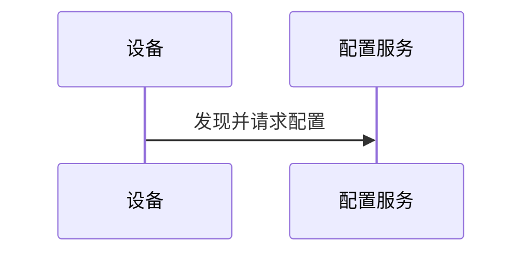
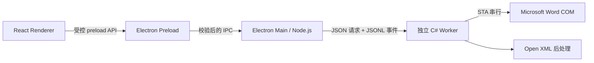

# MD2Word 文档生成器

MD2Word 是一个面向 Windows 的本地桌面工具：用户选择已配置的 Word 模板，选择或拖入 Markdown，再通过系统“另存为”指定输出位置即可生成 DOCX。DOCX 模板与 CSS 始终作为同一个配置单元导入、校验和使用，避免模板与样式搭配错误。

当前里程碑是 **Desktop MVP 0.5.0**，版本以 `package.json` 为单一真源。桌面链路已经接通 `React Renderer -> Electron Main -> .NET 8 C# Worker -> Microsoft Word COM -> Open XML`；浏览器 `npm run dev` 仍保留 mock adapter，供无 Word 环境下预览界面和状态机。两种运行方式会在界面中明确显示“桌面运行”或“交互原型”，不会把模拟能力冒充为真实转换。

## 0.5.0 已实现范围

- Electron 安全壳：`nodeIntegration` 关闭，启用 `contextIsolation` 与 `sandbox`，preload 只暴露窄接口；Renderer 不接收真实文件路径。
- Windows 原生 Markdown、DOCX、CSS 与输出对话框；文件通过 Main 签发的 opaque handle 登记，IPC 入参会在 Main 再次校验。
- 模板库：开发运行时位于应用 `userData`；打包后的 Portable 目录版、ZIP 解压版和单文件版都使用 `MD2Word.exe` 同级的 `templates`。DOCX 与内置/自定义 CSS 按模板隔离，Worker 校验书签、样式映射和 fingerprint 后再原子保存；警告需显式确认。
- 能力说明：`resources/conversion/capabilities.json` 是版本化机器清单，Worker 通过 `describe-capabilities` 返回当前安装版本的语法、Front Matter、模板契约、限制和工具依赖；Main 缓存结果并经窄 preload API 提供给“能力说明”页面。模板校验问题可携带 `capabilityId` 并跳到对应条目。浏览器 mock 直接导入同一 JSON，不维护另一套说明。
- 真实转换：Main 维护全局 FIFO 单任务队列，每次任务使用独立 Worker 和临时模板快照；C# Worker 在 STA 线程中操作独立 Word 实例，完成后显式关闭文档、退出 Word 并释放 COM 引用。
- Markdown 基线：Pandoc standalone HTML、相对本地资源地址解析，以及按固定顺序打包的 admonition、表格列宽意图、标题层级、图号四个 Lua filter。
- Word 引用块：普通 `>` 引用使用灰色背景/左线；开头合法的 `NOTE`/`说明`/`提示`、`CAUTION`/`注意`、`WARNING`/`警告`、`DANGER`/`危险` 使用固定语义配色。Open XML 只在 CSS/Word 已解析的 admonition 段落样式之上追加背景和 2.25pt 左侧单线，不改缩进、段距、行距、对齐、字体或字号；嵌套列表、表格和代码继续使用自身角色。
- 普通 fenced 代码块：转换为单个模板代码段落时，用 Word 手动换行保留源代码硬换行与空行，并用不可折叠空白保留行首缩进、连续空格和 tab 基线，避免普通 HTML 段落把代码压成一行。
- Mermaid 与图注：本地渲染 fenced `mermaid` 代码块为 PNG/SVG；只把紧随代码块、其间至多有空白的 `<!-- caption: ... -->` 绑定为图注，并兼容旧拼写 `cation`。渲染成功且带绑定图注的 Mermaid 与普通带图注图片一起在最终编号阶段获得按章图号；Word 导入前会把 figure 规范化为“独立居中图片段 + 紧邻独立图题段”，避免图号留在图片右侧。无图注 Mermaid 只生成图片，失败降级的代码块不占图号。
- 模板装配：只替换 `MANUAL_BODY_START` 与 `MANUAL_BODY_END` 之间的正文；显式 front matter 可更新封面标题、副标题与历史键 `manul_version_tables` 对应的版本表。
- 内部链接：Word 导入前只为被 `href="#..."` 实际引用的 HTML `id` 生成确定性的 ASCII 安全命名锚点，并把多个指向同一目标的链接重写到同一个书签。Word/Open XML 收口后再次校验生成链接数量未被 Word 丢失，且每个链接都能唯一命中成品书签；缺失或重复目标以 `INTERNAL_LINK_FINALIZATION_FAILED` 阻止发布。
- CSS 到 Word 样式：每个语义角色优先使用 CSS `mso-style-name` 显式映射；校验先按 style ID、名称或 alias 精确解析，精确候选不存在时才按 Word 内建样式中英文等价名解析（例如 `正文` ↔ `Normal`），真正的同名自定义样式始终优先。CSS 未配置该角色时，改为解析模板中已有的 Word 原生样式，而不是沿用 Pandoc/HTML 导入样式。当前覆盖正文、有序/无序列表、H1-H6、图题、表题、代码块、行内代码、表格单元格、admonition 和图片段；校验结果用 `resolved` / `word-fallback` 区分来源。模板导入阶段无法知道源文档最终会使用哪些标题级别，因此“CSS 未映射且模板缺少某级标题样式”是条件性 warning；Pandoc 完成 `heading_base_level` 重映射后，Worker 只在实际 HTML 使用该级标题时以 `WORD_NATIVE_STYLE_FALLBACK_MISSING` 阻止转换，未使用的 H5/H6 不再误伤模板。Word COM 保存时可能把模板样式 ID 重编号或本地化；Open XML 收口前会按原 style ID、名称、alias 及同一组等价的中英文 Word 内建名称重新绑定当前 `styles.xml`，保证图注等段落引用的样式定义真实存在，无法恢复或有歧义时拒绝发布。行内代码没有单独映射时继承已解析的正文角色，例如合成模板可解析为 `示例 正文`；Open XML 只对对应 run 清除 `HTML Code`/`HTML 代码` 导入样式，并在非正文段落中投影目标正文样式的计算字体属性。CSS 显式引用不存在或有歧义的样式仍会阻止模板保存/转换。成品会跨 `w:t` / `w:r` 及 Word 插入的 `w:lastRenderedPageBreak` 清除角色标记，同时保留分页提示，并移除 `manual-*` 等临时段落样式和会覆盖模板的 HTML 直接格式；若仍有可见标记或标记字符样式引用，则以 `ROLE_MARKER_FINALIZATION_FAILED` 拒绝发布。粗体、斜体和超链接继续使用 Word 字符级语义。
- 原生 Word 列表：Markdown `-` / `*` / `+` 与 `1.` 会保留 `w:numPr`、`w:ilvl`、`w:numId` 和 `w:numFmt`，再按有序/无序角色应用目标 `w:pStyle`。当有序目标样式自带 Word 编号定义时，派生列表会采用该样式各级的编号文本、字体与缩进，同时保留 Markdown 起始号、分离重启和混合嵌套；无序目标样式没有原生编号时，不再沿用 HTML 的 `Symbol • / Courier ○ / Wingdings ■`，而是使用 Word 项目符号库一致的 `Wingdings ● / ■ / ◆`、22pt 悬挂和每级 11pt 的“增加缩进”步长。当目标正文样式的正首行缩进为 21pt 时，三级标记位置为 21/32/43pt、文字位置为 43/54/65pt。派生定义使用独立 Word 编号身份，且只重绑正文目标段落，防止 Word 缓存旧外观或改动模板固定区域。已覆盖非 1 起始、二至三级混合嵌套、tight/loose、多段落条目，以及列表内代码和合成图片场景。
- Front Matter 标题与表格控制：`heading_numbering` 默认开启；`heading_numbering_start_base` 可从第 N 个起始层级标题开始编号；`word_heading_numbering.level1..4` 可分别配置 `decimal`、大小写罗马数字或大小写字母及编号格式；`word_repeat_table_headers` 默认开启。标题使用 Word 原生多级列表并在目录/字段更新前应用，重复表头只收口正文书签范围内的表格，不改模板固定区域。
- 普通与规则合并表格：无合并表格固定到当前 section 版心，两列按 24%/76% 固定布局；规则矩形 HTML `rowspan` / `colspan` 表格保留 Word 导入的 `w:vMerge` / `w:gridSpan` 与 AutoFit 列比例，同时固定版心宽度。两类表格都清除 HTML 导入的表/行级单元格间距，写入连续 0.5pt 黑色全网格、4pt 上下与 6pt 左右内边距和垂直居中；单元格仍使用映射后的 Word 段落样式，但直接覆盖为 0 首行缩进、单倍行距，表头居中加粗、正文左对齐。相邻独立表格之间由 Word HTML 导入产生的结构性空段落会清除隐藏/直接格式并直接引用 CSS 最终解析的正文样式，不注入额外的表间隔样式。
- 结果安全：Worker 先验证临时 DOCX，Main 再把结果原子替换到用户选择的位置；打开文件和定位目录只接受已登记的 `jobId`。

### Mermaid Markdown 契约

````markdown

<!-- caption: 设备发现与网络配置系统架构时序 -->
````

- `caption` 注释必须是 Mermaid 代码块后的下一个非空白节点；中间出现正文、其他元素或其他注释都不绑定。历史输入 `<!-- cation: ... -->` 继续兼容，新文档应使用 `caption`。
- `auto`：逐图尝试渲染；单图失败时保留该代码块并返回稳定告警，原注释不变成孤立图注，其他成功图继续生成。
- `off`：不启动 Mermaid 渲染，代码块按普通代码保留。
- `required`：任一图无法渲染、缺少 npx/本地浏览器或输出校验失败时，任务在 Mermaid 阶段失败，不发布部分 DOCX。
- `png` 和 `svg` 均可选。只有渲染成功且带相邻图注的图进入普通图片共用的最终图号序列，例如 `图 1.1 设备发现与网络配置系统架构时序`；`figure_captions: false` 会关闭图注和图号。
- Mermaid 图片写入待导入 HTML 时带 `width="600"` 与 `width: 600px; max-width: 100%; height: auto`，在保持宽高比的同时限制 Word 中的显示宽度，避免高倍率 PNG 按自然像素宽度溢出版心。

### 标题编号与重复表头 Front Matter 契约

```yaml
---
heading_base_level: 2
heading_numbering: true
heading_numbering_start_base: 2
word_repeat_table_headers: true
word_heading_numbering:
  level1:
    number_style: decimal
    format: "%1."
  level2:
    number_style: decimal
    format: "%1.%2"
  level3:
    number_style: decimal
    format: "%1.%2.%3"
  level4:
    number_style: decimal
    format: "%1.%2.%3.%4"
---
```

- `heading_numbering` 和 `word_repeat_table_headers` 缺失时均默认开启；前者设为 `false` 时不应用标题编号，后者设为 `false` 时清除正文表格的重复表头标记。
- `heading_numbering_start_base` 是从 1 开始的正整数；值为 `2` 时，第一个映射后一级标题及其子标题不编号，从第二个一级标题开始使用 Word 原生多级编号。
- `number_style` 支持 `decimal`、`upper_roman`、`lower_roman`、`upper_letter`、`lower_letter`；未配置的层级回退到上例十进制格式。非法类型、未知样式或空 `format` 会在元数据阶段返回 `FRONT_MATTER_INVALID`。
- 标题应用模板段落样式时会清除 HTML 导入遗留的直接段落、字体、字号和字距格式，参与编号的标题在成品中共享同一原生多级编号实例；正文装配还会在发布前验证 `MANUAL_BODY_START` / `MANUAL_BODY_END` 唯一、成对且顺序正确。
- 成品 DOCX 保存后会重开，只对正文书签范围内的随文图片按当前 section 版心减去正段落缩进进行等比缩小；较小图片不放大，模板固定区域图片不修改。尺寸判断统一使用 1pt 的 Word 布局容差，避免已经贴合版心的图片因为 COM 浮点误差再次经过近似的 `ScaleWidth` 百分比而被反向放大。Word 导入 HTML 时若把含非 ASCII 文件名的本地 URI 再转义一层，Worker 会在确认目标仍是可读取的本地图片后恢复路径、用 Word 原生方式重新插入并保留替代文本/标题；图片段同时改用可自动扩展的单倍行距，避免模板正文的固定行距把图片裁成横条。

## 仍在迁移的兼容能力

0.5.0 是可运行的桌面 MVP，不等于旧 WordDOM 链路已经完整复刻：

- 表格 Lua filter 已保留宽度意图；无合并的普通正文表格会固定到当前 section 版心，两列按审计契约收口为 24%/76%；规则矩形 `rowspan` / `colspan` 表格保留合并结构和 AutoFit 比例并完成版心、连续单线网格、内边距、垂直对齐、表头及单元格段落节奏收口；正文跨页重复表头开关也已完成。多列复杂比例、不规则网格、合并表格的高级固定列宽及跨 Office 复杂表视觉仍未完成一致性验收。
- 相对本地图片已完成嵌入，含非 ASCII 文件名且被 Word 二次转义的本地 URI 也可恢复；正文随文图片已按动态版心上限等比缩小，并用自动扩展行距避免固定正文行距裁图。浮动图片、文本框、多栏、复杂表格单元格可用宽度、裁剪/环绕及跨 Office 视觉仍待专项验收。
- Mermaid PNG/SVG 与相邻图注已有合成结构和真实 Word 基线；所有 Mermaid 图型、复杂 SVG 及不同 Office 版本的逐页视觉一致性仍需私有基准样本比较。admonition 的固定背景/2.25pt 左线基础视觉已实现；图标、文字色、内边距、圆角、连续多段盒子等更丰富旧版布局、目录/字段细节及完整 WordDOM 视觉一致性仍待逐项比较。
- Windows x64 的 0.5.0 未压缩便携目录、单文件便携版和便携 ZIP 已产出。目录版已通过窗口启动、Worker 能力查询、资源/模板检查和窄 API packaged E2E；0.4.0 的目录版与 ZIP 解压版另有完整 Mermaid -> Word 真实转换基线，单文件版另有自解压与主窗口就绪 smoke。当前 EXE 未签名，代码签名与正式发布流程仍属于后续工作。

转换成功时界面会展示上述基线兼容警告；不要把“生成了 DOCX”解读为所有旧版版式都已完成验收。

## 运行要求

桌面转换需要：

- Windows 与桌面版 Microsoft Word。
- Pandoc；当前 MVP 使用外部 Pandoc，需能被应用检测到，或通过开发环境配置提供路径。
- Mermaid 渲染需要可用的 `npx`，以及本机 Microsoft Edge 或 Google Chrome。应用固定调用 `@mermaid-js/mermaid-cli@11.16.0` 和 `puppeteer@25.3.0`，清除会导致 Edge 兼容层二次拉起的继承环境后优先复用本地浏览器。若已检测浏览器仍启动失败，Worker 会返回内部分类 `MERMAID_BROWSER_LAUNCH_FAILED`，显式准备对应的 `chrome-headless-shell` 到应用私有持久缓存并重试一次；安装最多等待 15 分钟，失败或超时分别稳定为 `MERMAID_BROWSER_INSTALL_FAILED` / `MERMAID_BROWSER_INSTALL_TIMEOUT`。首次使用可能下载固定 CLI 包和受管浏览器二进制，但不会上传 Markdown、模板、图片或 Mermaid 图源。
- 开发/构建需要 Node.js LTS、npm 与 .NET 8 SDK。发布后的 Worker 为 `win-x64` self-contained。

安装依赖：

```powershell
npm install
```

仅预览浏览器 mock：

```powershell
npm run dev
```

运行桌面开发版：

```powershell
npm run dev:desktop
```

构建桌面产物或生成 Windows x64 候选包：

```powershell
npm run build

# 只生成可公开分发的基线包
npm run package:win
```

`npm run capabilities:generate` 从机器清单生成 [离线支持能力说明](resources/docs/MD2Word-支持能力说明.md)，`npm run capabilities:check` 会阻止版本不一致或生成文档漂移；桌面生产构建和 Windows 打包都会运行该检查。目录版和 ZIP 内把说明放在 `MD2Word.exe` 同级，`release` 根也保留一份供单文件 Portable EXE 一起分发。

`package:win` 不读取任何私有目录。[`resources/templates`](resources/templates/README.md) 本身就是完整的公开模板包容器：根目录不放 `index.json`，每个直接子目录包含自己的精简 `index.json`，其索引模板子目录内固定使用 `template.docx` / `style.css`。打包程序遍历并校验所有包及每一组 DOCX/CSS，只把索引和索引声明的文件原样复制到 `release/templates`，不再临时生成或重写 JSON。当前 `reference` 包包含 [`public-reference-template`](resources/templates/reference/public-reference-template/)；需要增加可公开模板时，可手工复制另一个完整包到 `resources/templates/`。应用加载时重新计算完整 validation 与样式映射并只保留在内存；通过界面新导入的模板写入 `templates/user/`。

自定义模板分发不再重新打包，包名可自定义：把仓库外完整私有模板包复制到发行包 `templates/<package-name>/` 即可。包目录自身应包含 `index.json` 及其索引登记的模板子目录；不要只复制其中的 DOCX。单文件 Portable EXE 使用 `release/templates/<package-name>/`，未压缩目录版使用 `release/<portable-directory>/templates/<package-name>/`；使用 ZIP 时应先解压、复制模板包，再按内部流程重新压缩。公开参考模板不声明默认模板，任一私有包可声明唯一默认模板；跨包模板 ID 重复或同时声明多个默认模板时，应用会明确拒绝加载。重新执行 `package:win` 会重建 `release`，因此私有包原件必须始终保存在仓库外。当前 0.5.0 基线候选如下：

| 交付物 | 大小/说明 |
|---|---:|
| `release/MD2Word-0.5.0-win-x64-portable/` | 未压缩目录，88 个文件；含离线能力说明和 1 个参考模板 |
| `release/MD2Word-0.5.0-win-x64-portable.exe` | 112,686,014 字节 |
| `release/MD2Word-0.5.0-win-x64-portable.zip` | 170,542,279 字节 |
| `release/MD2Word-支持能力说明.md` | 17,331 字节；供单文件版并列分发 |

目录版/ZIP 内的 `templates` 与 `MD2Word.exe` 同级；单文件 Portable EXE 必须和 `release/templates` 一起分发。源码构建完成时其中只包含 `resources/templates/` 中已审核的公开包；当前仓库仅有 `reference/`。之后手工加入的任意私有包严禁上传 GitHub。Portable EXE 仍为 `NotSigned`。

## 验证

提交前至少执行：

```powershell
npm run typecheck
npm run lint
npm run test
npm run test:worker
npm run build:worker
npm run test:protocol
npm run build
npm run test:e2e
```

真实 Word 端到端测试只使用运行时生成的合成夹具，并需显式开启：

```powershell
$env:MD2WORD_RUN_WORD_E2E = '1'
dotnet test worker\Md2Word.Worker.sln -c Release
```

真实 Mermaid CLI 与 Mermaid -> Word 用例还需开启 Mermaid 门控；后者同时保留 Word 门控：

```powershell
$env:MD2WORD_RUN_MERMAID_E2E = '1'
$env:MD2WORD_RUN_WORD_E2E = '1'
dotnet test worker\Md2Word.Worker.sln -c Release
```

需要复核 DOM 导入间距、HTML 残留和 Word 原生 PDF 时，使用运行时合成的复杂夹具和专项审计；完整口径、命令与最近结果见 [复杂合成文档专项验收](doc/testing/comprehensive-synthetic-acceptance.md)。

生成候选包后，可直接对未压缩 Portable 目录执行 packaged 启动、内置资源与 preload 边界检查：

```powershell
$env:MD2WORD_RUN_PACKAGED_E2E = '1'
$version = (Get-Content package.json | ConvertFrom-Json).version
$env:MD2WORD_EXPECTED_TEMPLATE_ID = 'public-reference-template'
$env:MD2WORD_EXPECTED_TEMPLATE_COUNT = '1'
$env:MD2WORD_PACKAGED_EXE = (Resolve-Path "release\MD2Word-$version-win-x64-portable\MD2Word.exe").Path
npx playwright test --config playwright.electron.config.ts e2e/electron-packaged.spec.ts
```

在安装了 Word 的发布主机上，还应把同一 packaged 可执行文件交给完整转换 E2E：

```powershell
$env:MD2WORD_RUN_DESKTOP_WORD_E2E = '1'
$version = (Get-Content package.json | ConvertFrom-Json).version
$env:MD2WORD_E2E_EXECUTABLE = (Resolve-Path "release\MD2Word-$version-win-x64-portable\MD2Word.exe").Path
npx playwright test --config playwright.electron.config.ts e2e/electron-smoke.spec.ts
```

Playwright 的 Electron 附加测试应指向未压缩目录或 ZIP 解压目录中的真实 `MD2Word.exe`，不要直接指向单文件 `*-portable.exe`：Portable 包装器会先自解压并派生真正的 Electron 子进程，Playwright 无法附加到包装器本身。单文件版应单独做“启动包装器 -> 等待新 `MD2Word` 子进程出现主窗口 -> 关闭该批进程”的自解压/窗口 smoke。

下一段保留能力说明增量完成时的历史记录；其中“未重新执行全门控”的状态已被同日稍后的复杂合成专项重跑覆盖，以其后的追加结果为当前结论。

截至 2026-07-20，0.5.0 候选已通过能力清单/生成文档同步检查、TypeScript 检查、Lint、95 项 Vitest（23 个测试文件，新增能力清单深校验、页面搜索/深链和重复 ID 拒绝）、Worker 常规测试（126 通过、11 个真实环境用例按门控跳过）、包含 `describe-capabilities` 的协议 smoke、生产构建、Electron 四页安全壳 E2E、8 张桌面截图生成/视觉复核，以及目录版 packaged E2E。0.4.0 转换基线此前同时启用 Word/Mermaid 双门控后为 136/136；本次仅增加说明/协议/UI，不把该历史结果改写成未运行的 0.5.0 全门控结果。既有真实用例覆盖模板样式主导的标题编号、共享 `numId`、正文书签契约、正文随文大图等比缩小、非 ASCII 本地图片 URI 恢复和图片段自动行距、原生列表、代码块硬换行/缩进、行内代码样式投影、Word 保存后样式 ID 重绑定、跨分页节点角色标记清理、普通及规则矩形合并表格收口、相邻表格空段落的 CSS 正文样式恢复、五类 admonition 配色及 Word 再保存、PNG/SVG、Caption 样式、空 CSS 的 Word 原生样式回退、取消及专用 WINWORD 退出。历史自定义模板检查的通用结论是：显式样式需与配套 CSS 成组验证，样式引用、原生列表、代码换行、图片、图题及表格结构必须保持一致。公开记录不保留私有文档内容、页码或样本统计。尚未完成 Authenticode 签名，以及不规则网格、高级图片布局、丰富 admonition 布局和完整 WordDOM 视觉一致性验收。

同日追加的复杂合成专项已在 0.5.0 当前代码上重新执行真实 Word/Mermaid 双门控，结果为 `137/137` 通过、`0` 跳过；专项 DOCX/PDF 审计 `30/30` 通过。9 页 Word 原生 PDF 中，模板原生正文对与 DOM 导入正文对的间距分别为 `26.76pt` 和 `26.64pt`，差 `0.12pt`，未发现 DOM 额外间距；成品 `w:altChunk` / HTML 可见标签 / 临时样式 / 外部关系 / 浮动或文本框残留均为 `0`。重复转换结构指标一致，Mermaid `auto/off/required` 分支均符合契约，真实 Electron -> Main -> Worker -> Word 用例复跑通过且最终 WINWORD 残留为 `0`。基础桌面 smoke 夹具曾因未映射三个角色而触发 `Normal` 同名重绑定歧义，补齐夹具 CSS 映射后原用例通过。详细证据和保留风险见 [复杂合成文档专项验收](doc/testing/comprehensive-synthetic-acceptance.md)。

### 2026-09-09 公开内容脱敏验证

演示数据、能力清单、离线说明、合成夹具和测试断言统一使用中性样式名；移除组织来源路径与私有文档细节，保留通用兼容结论。样式解析算法、模板书签、IPC 和存储契约不变，既有用户 DOCX/CSS 按原名动态解析；本次不迁移用户数据，不处理 Git 历史。

- 类型检查、Lint、95 项 Vitest、能力清单同步、生产构建和 Worker 协议 smoke 均通过。
- Worker 常规测试为 126 通过、11 跳过；设置 `MD2WORD_RUN_WORD_E2E=1` 和 `MD2WORD_RUN_MERMAID_E2E=1` 后，137 项全部通过、0 跳过。
- 设置 `MD2WORD_RUN_DESKTOP_WORD_E2E=1` 运行桌面 E2E，四页/安全边界与真实 Word 转换两项通过；打包和截图用例由各自专用命令执行。
- 设置 `MD2WORD_UPDATE_SCREENSHOTS=1` 重新执行截图用例并通过，8 张截图已逐张复核；覆盖 1440x900、1280x800 及弹窗 1100x720 边界检查。
- 当前受跟踪文本、文件名及公开参考 DOCX 内部 XML 的组织标识扫描无命中，依赖完整性哈希不作文本替换。旧浏览器 mock 缓存可通过“重置演示数据”恢复中性演示配置；已有用户模板不会被改名。
- `npm run package:win` 已重建目录版、Portable EXE/ZIP 与离线说明。打包版启动/Worker/唯一参考模板检查通过；包内应用文本、能力清单及离线说明未检出组织标识，ZIP 中的应用归档、说明和参考 DOCX 与目录版一致。未上传或公开发布；单文件 EXE 本次只完成构建，启动验证使用目录版。

构建和常规 Worker 测试仍报告既有 `AngleSharp 1.3.0` 的 `NU1902` 依赖告警；本次未升级依赖。复杂 DOCX/PDF 专项仍为上文所列历史结果，本次未重新执行该专项。

## 架构概览



详细接口、协议、安全边界和当前实现状态见 [Electron + C# 架构](doc/architecture/electron-csharp.md)。

## 文档入口

| 文档 | 内容 |
|---|---|
| [支持能力说明](resources/docs/MD2Word-支持能力说明.md) | 由机器清单生成的语法、Front Matter、模板契约、限制和工具依赖 |
| [产品需求](doc/requirement/requirements.md) | 0.5.0 范围、功能需求、验收和后续兼容目标 |
| [UI 规格](doc/requirement/ui-spec.md) | 桌面/浏览器双运行模式下的页面、状态与文案 |
| [UI 与桌面验收说明](doc/uiPrototype/README.md) | 运行方式、演示路径、测试和截图状态 |
| [Electron + C# 架构](doc/architecture/electron-csharp.md) | 已实现分层、共用契约、Worker 协议和安全要求 |
| [旧链路审计](doc/architecture/legacy-pipeline-audit.md) | WordDOM 行为基线、已迁移能力和剩余差异 |

## 数据与仓库安全

- 真实业务 DOCX、用户 Markdown 正文、客户图片、生成结果和旧仓库业务资料不得提交。DOCX 例外仅限 `resources/templates/<package>/<template-id>/template.docx` 结构内明确无业务内容、可公开分发且由 Worker 校验的合成模板；当前只有 `resources/templates/reference/public-reference-template/template.docx`。
- 合成测试文件只在被忽略的临时/输出目录中运行时生成，不把 DOCX 夹具加入仓库。
- 开发运行的模板与 CSS 位于 Electron `userData`；Portable 发布运行时位于 `MD2Word.exe` 同级 `templates`，由 Main 受控维护。
- 技术报告、使用说明书等私有 DOCX/CSS 只能从仓库外目录手工复制到本机发布包；`templates/local/` 仅作自动清理的 Git 忽略暂存，`release/` 也不得提交或上传 GitHub。
- GitHub 目标仓库必须保持 Private；任何发布或权限调整后都要复核可见性。
- 完整协作与文档同步规则见 [AGENTS.md](AGENTS.md)。
