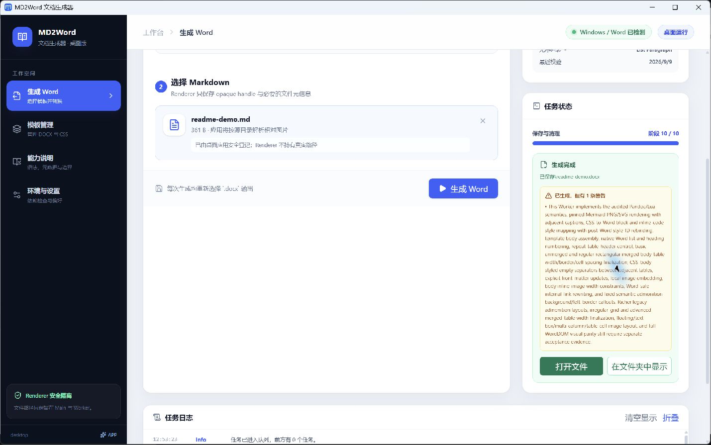
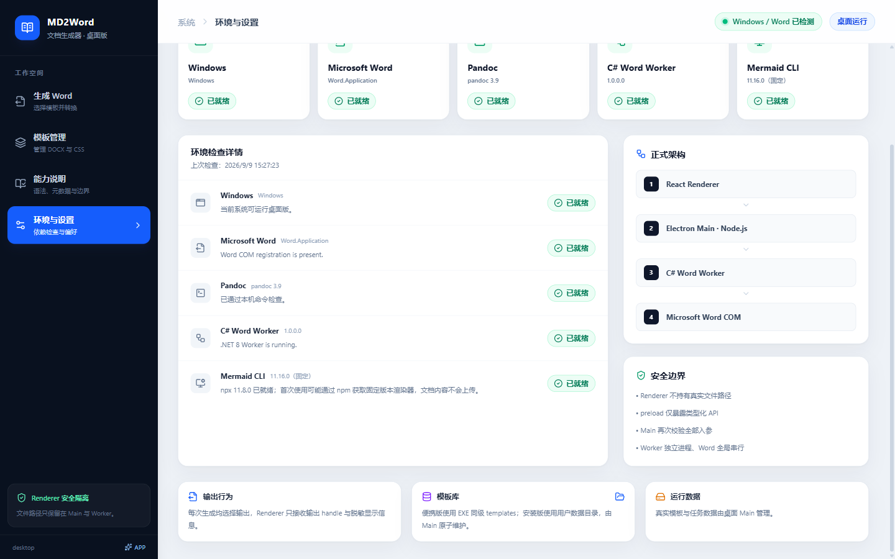

# MD2Word 文档生成器

把 Markdown 按指定的 Word 模板生成 DOCX，适合需要统一封面、标题、正文、列表和表格样式的文档。

MD2Word 是 **Windows 本地桌面工具**，当前版本为 **0.6.1（Desktop MVP）**。选择一组 DOCX 模板与 CSS、添加 Markdown，再选择输出位置即可生成 Word 文档。文档内容在本机处理。

**[从源码部署](#source) · [工具使用说明](#usage) · [常见问题](#faq)**

已有便携版可以直接阅读使用说明。浏览器预览仅模拟交互；真实转换需要 Windows 桌面版 Microsoft Word 和 Pandoc。

GitHub 的 `Windows release` 工作流会为版本标签构建 Portable ZIP 和 Setup EXE，并作为 Release 附件提供下载；手动运行时可从 Actions artifact 下载。操作与环境说明见 [GitHub 发布流程](doc/development/github-release.md)。

**`v0.6.1` 已公开发布**，Portable ZIP 和 Setup EXE 均包含离线模板制作指南；原有 `v0.6.0` 保持不变。

仓库与 Release 现已公开。发布内容仅含脱敏源码和公开合成模板，用户自己的文档与模板仍由本机管理。

<a id="source"></a>

## 1. 从源码部署

这里的“部署”指在 Windows 上安装开发依赖、运行桌面应用或构建便携版，不需要搭建服务器。

### 1.1 准备环境

| 依赖 | 要求与用途 |
|---|---|
| Windows x64 | 当前桌面构建的目标平台 |
| Microsoft Word 桌面版 | 能正常启动；源码构建还需 Office Word PIA（互操作程序集） |
| Pandoc | 安装后可在终端运行 `pandoc --version` |
| Node.js 与 npm | 本项目已使用 Node.js 24.x 验证；安装时一并安装 npm/npx |
| .NET 8 SDK | 用于构建 Word Worker；便携版自带 Worker 运行时 |
| Git | 用于获取源码；也可使用已下载的源码目录 |
| npx + Edge 或 Chrome | 可选，用于渲染 Mermaid 图表 |

在 PowerShell 中检查依赖：

```powershell
node --version
npm --version
dotnet --list-sdks
pandoc --version
```

### 1.2 获取源码并启动

将 `<仓库地址>` 替换为你有权限访问的 Git 地址；已有源码则直接进入项目目录。

```powershell
git clone <仓库地址> md2word
cd md2word
npm install
npm run dev:desktop
```

启动命令会构建 Electron 和 C# Worker，再打开桌面窗口。“桌面运行”表示使用真实本地转换能力。

**开发模式首次使用通常没有模板。** 在“模板管理”中导入源码自带的公开参考模板，选择“自定义 CSS”，并配对以下文件：

```text
resources/templates/reference/public-reference-template/
  template.docx
  style.css
```

具体操作见下面的“添加或维护模板”。

### 1.3 构建便携版与 Setup 安装版

只构建并运行桌面产物：

```powershell
npm run build
npm run start:desktop
```

生成可复制到其他 Windows 电脑的便携版：

```powershell
npm run package:win
```

结果位于 `release/`，文件名中的版本来自 `package.json`：

| 产物 | 使用方式 |
|---|---|
| `MD2Word-0.6.1-win-x64-portable/` | 保留完整目录，运行其中的 `MD2Word.exe` |
| `MD2Word-0.6.1-win-x64-portable.zip` | 解压后运行其中的 `MD2Word.exe` |
| `MD2Word-0.6.1-win-x64-portable.exe` | 单文件启动器，与同级 `templates/` 一起分发 |
| `MD2Word-0.6.1-win-x64-setup.exe` | 安装向导：当前用户安装，可选择目录并创建桌面/开始菜单快捷方式 |
| `templates/` | 单文件版配套模板库；基线包含公开参考模板 |
| `MD2Word-支持能力说明.md` | 随包离线使用参考 |
| `MD2Word-模板制作指南.md` | 从参考模板修改或空白 DOCX 开始制作的离线教程 |

目标电脑仍需 Microsoft Word 和 Pandoc。Setup 包含应用、Worker、离线说明及公开参考模板，无需另带 `templates/` 文件夹；安装后从快捷方式启动。当前便携版和 Setup 均尚未完成代码签名。

打包会重建 `release/`；自定义模板原件应保存在其他位置。基线只包含经校验的公开合成模板包，不会自动收集用户模板。

### 1.4 浏览器预览与开发检查

只想查看界面时，安装 npm 依赖后运行 `npm run dev`，再打开终端显示的浏览器地址。此模式使用演示模板、模拟环境和模拟任务，**不会生成真实 DOCX**。

修改代码后执行基本检查：

```powershell
npm run typecheck
npm run lint
npm run test
npm run build
```

Worker、真实 Word/Mermaid、桌面交互和打包测试的完整命令及已运行结果见 [开发与验收说明](doc/uiPrototype/README.md#运行与检查)。

0.6.0 已通过类型检查、Lint、101 项前端/存储测试、Worker 常规测试、真实桌面转换和四种交付物构建；Setup 的安装、同版本覆盖安装、用户模板保留及默认卸载也已实际验证。范围与限制见 [Setup 验收记录](doc/testing/setup-installation.md)。

0.6.1 已通过本地类型检查、Lint、101 项前端/存储测试、Worker 常规测试、构建及带指南的打包检查；本次未重复真实 Word 和安装生命周期专项。GitHub 同版本构建与发布也已通过，发布的 ZIP 已下载核对版本、完整性及指南内容。

<a id="usage"></a>

## 2. 工具使用说明

第一次使用按“检查环境 → 准备模板 → 添加 Markdown → 生成 Word”操作。以后可以直接选择模板和文件生成。

以下截图来自真实桌面应用，模板和文档均为公开合成示例。

### 2.1 检查运行环境

打开“环境与设置”，点击“重新检查”。Windows、Microsoft Word、Pandoc 和 C# Word Worker 应处于就绪状态。

Mermaid 是可选项：不使用图表时，可在模板中将模式设为 `off`；使用图表时需要可用的 npx 和本地浏览器。


### 2.2 添加或维护模板

**还没有可用模板？先看 [模板制作指南](resources/docs/MD2Word-模板制作指南.md)**：从复制参考模板或空白 DOCX 开始，逐步设置正文书签、Word 样式、配套 CSS、可选封面和版本表，再导入试转。

从 0.6.1 起，Portable ZIP 和 Setup 都包含这份离线指南；已发布的 `v0.6.0` 附件保持原样。指南中的 CSS 已通过 16 个角色映射校验，最小 Markdown 已完成真实 Word 试转。

便携版自带“公开参考模板”，可先用它完成一次转换。需要自定义版式时：

1. 打开“模板管理”，点击“添加模板”。
2. 填写名称和用途，选择 `.docx` 模板。
3. 选择“使用内置默认 CSS”，或选择“自定义 CSS”并添加配套的 `.css` 文件。
4. 根据需要设置 Mermaid 模式和图片格式。
5. 点击“校验配置”，检查结果后点击“保存模板”。有警告时，检查后使用“确认警告并保存”；校验失败时需先修正模板或 CSS。


DOCX 与 CSS 是一组配置。模板必须包含按顺序排列的 `MANUAL_BODY_START`、`MANUAL_BODY_END` 正文书签；CSS 显式引用的 Word 样式必须存在。普通 DOCX 不一定是有效模板，建议从公开参考模板开始调整。完整要求见 [模板与样式契约](resources/docs/MD2Word-支持能力说明.md)。

模板列表支持重新校验、编辑、设为默认和删除。删除只移除应用管理的副本，不删除导入时选择的原文件。

### 2.3 选择模板与 Markdown

打开“生成 Word”。点击“更换模板”搜索并切换模板，再把一个 `.md` 或 `.markdown` 文件拖入文件区域，或点击该区域选择文件。

确认右侧“当前配置”符合预期。Markdown 引用相对路径图片时，请保留 Markdown 与图片之间的目录关系。


### 2.4 生成并查看结果

1. 点击“生成 Word”。
2. 在 Windows“另存为”窗口中选择位置和文件名。取消该窗口会返回页面，不启动任务。
3. 等待任务完成；页面显示当前阶段和日志。需要中止时点击“取消生成”，等待清理结束。
4. 成功后点击“打开文件”查看 DOCX，或点击“在文件夹中显示”定位结果。若有兼容警告，请结合生成文档检查对应内容。



输出位置每次生成时选择，不固定在模板库中。失败时查看错误原因和日志，修正环境、模板或 Markdown 后再试。

### 2.5 模板保存在哪里

| 运行方式 | 模板库位置 |
|---|---|
| 便携目录版、ZIP 解压版 | `MD2Word.exe` 同级的 `templates/` |
| 单文件便携版 | 用户启动的 Portable EXE 同级 `templates/`，不是自解压临时目录 |
| 从源码运行桌面版 | Electron 应用数据目录 `userData` 下的 `templates/` |
| Setup 安装版 | 同样使用用户数据目录 `userData/templates/`；首次启动复制公开模板，升级与默认卸载保留已有用户模板 |

在“环境与设置”中可以打开当前模板库。安装版请通过这个入口管理模板，不要修改安装目录内的模板种子文件。升级不会覆盖已存在的模板包，也不会恢复你已在包内删除的模板。



界面导入的模板会复制为：

```text
templates/
  user/
    index.json
    <模板ID>/
      template.docx
      style.css
```

应用使用复制后的文件；修改原文件不会自动同步，需要通过“编辑模板”重新选择并校验。内置默认 CSS 也会保存为一份 `style.css`。

分发整套配置时，将完整模板包放到 `templates/<包名>/`，重启应用后发现。每个包须有自己的 `index.json` 和配套文件；只放一个 DOCX 不会自动加入列表。当前没有追加外部搜索目录的设置或命令行参数。

### 2.6 Markdown 与 Mermaid

当前支持标题、段落、列表、代码块、行内代码、本地图片、内部链接、基础表格、引用提示块，以及 Mermaid PNG/SVG。封面标题、标题编号、重复表头等可通过 Front Matter 配置。

在“能力说明”中搜索语法或配置名称，可以查看当前版本的条件、示例和限制。也可以阅读随包的 [离线支持能力说明](resources/docs/MD2Word-支持能力说明.md)。

| Mermaid 模式 | 行为 |
|---|---|
| `off` | 保留代码，不渲染图表 |
| `auto` | 尝试渲染；某张图失败时保留该图代码并提示警告 |
| `required` | 任意图表渲染失败即终止转换，不发布部分成品 |

首次使用可能下载工具包；系统浏览器启动失败时还可能下载受管浏览器。下载只用于准备工具，不上传文档或图源。

0.6.0 尚未承诺不规则复杂表格、高级浮动图片/文本框布局、丰富引用框装饰，以及所有 Office 版本之间的版式完全一致。生成成功后仍应检查最终文档。

<a id="faq"></a>

### 2.7 常见问题

| 问题 | 处理方式 |
|---|---|
| 开发版模板列表为空 | 按 2.2 导入源码中的公开参考 DOCX 和配套 CSS；开发模式不会自动加载发布目录的模板库 |
| 模板校验失败 | 检查正文书签、DOCX/CSS 是否配对，以及 CSS 引用的样式是否存在 |
| “生成 Word”不可用 | 确认已选模板和 Markdown、模板可用、必需环境就绪，且没有正在执行的任务 |
| 找不到 Word 或 Pandoc | 确认安装的是桌面版 Word；在终端确认 Pandoc 可用，重启应用后再次检查环境 |
| 构建提示缺少 Office Word PIA | 安装 Office 提供的 Word 互操作程序集；仅安装 .NET SDK 不够 |
| 模板无法保存 | 确认模板库目录可写；便携版不会自动切换到另一套目录 |
| 浏览器操作没有生成文件 | `npm run dev` 是模拟预览；真实转换请使用桌面版 |
| Mermaid 失败 | 检查 npx 与浏览器并查看日志；不需要图表时将模式改为 `off` |

### 2.8 更多文档

| 文档 | 内容 |
|---|---|
| [支持能力说明](resources/docs/MD2Word-支持能力说明.md) | Markdown、Front Matter、模板契约与限制 |
| [模板制作指南](resources/docs/MD2Word-模板制作指南.md) | Word 书签、段落样式、配套 CSS、封面与版本表的操作步骤 |
| [开发与验收说明](doc/uiPrototype/README.md) | 检查命令、实际验证结果和截图清单 |
| [产品需求](doc/requirement/requirements.md) / [UI 规格](doc/requirement/ui-spec.md) | 产品范围、页面交互与验收口径 |
| [Electron + C# 架构](doc/architecture/electron-csharp.md) | 分层、IPC、存储与安全边界 |
| [WordDOM 兼容审计](doc/architecture/legacy-pipeline-audit.md) | 兼容基线与已知差异 |

协作规则见 [AGENTS.md](AGENTS.md)。请勿将用户模板、业务文档或转换产物提交到仓库；公开示例和截图只使用合成内容。
