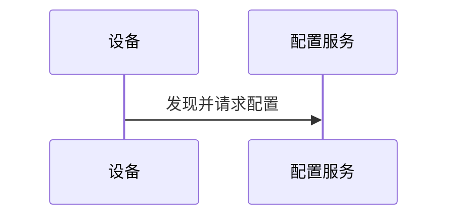

# Electron + Node.js + C# Word Worker 架构

## 1. 状态与决策

本文同时记录目标边界与 **Desktop MVP 0.6.1 的实际实现**。Electron 安全壳、受控 preload、Main 模板库/原生对话框/串行队列、JSONL Worker 客户端，以及 .NET 8 C# STA Word Worker 已经接通；浏览器运行仍通过同一页面状态机使用 mock adapter。

采用以下分层：

```text
React Renderer
    -> typed preload API
Electron Main / Node.js
    -> stdin JSON command + stdout JSONL events
.NET 8 C# Worker (one process per operation)
    -> STA Microsoft Word COM
    -> Open XML post-processing
```

关键决策：

- 选择 Electron 以复用 React/TypeScript，并用 Node.js 统一桌面窗口、文件对话框、模板库与任务调度。
- Node.js 不直接操作 COM，避免 `winax` 等 Electron 原生模块的 ABI、重编译和资源释放风险。
- C# Worker 是单独进程；Word COM 只在 STA 线程运行，Open XML 用于最终包级收口。
- 保留 Pandoc/Lua 的 Markdown 结构转换，不把 C# 重写扩大为 Markdown 解析器重写。
- 所有 Word 转换全局串行；每次转换使用新 Worker 和独立临时目录。

0.4.0 的真实转换是旧 WordDOM 的迁移基线，不是完整兼容终点。已经实现四个 Lua filter、模板正文装配与成品书签契约验证、内部链接 ASCII 安全书签重写与成品匹配校验、front matter 封面/版本表、模板样式主导的 Word 原生多级标题编号、正文跨页重复表头、CSS 样式解析及 Word 保存后 style ID 重绑定、原生列表收口、无合并及规则矩形合并表格基础收口、相邻表格空段落的 CSS 正文样式恢复、正文随文图片动态版心缩小、非 ASCII 本地图片 URI 恢复和图片段自动行距，以及固定版本 Mermaid CLI 的 PNG/SVG 本地渲染、相邻图注绑定、统一图号和浏览器启动回退；高级图片布局、不规则/高级宽度表格及完整视觉一致性仍待迁移。

## 2. 运行时职责

### 2.1 React Renderer

- 展示页面和业务状态，不持有任意文件系统或进程权限。
- 只调用 `window.md2word` 的窄接口。
- 显示文件名、模板能力、进度和脱敏日志；不读取 DOCX，不把完整文档内容写入状态持久化。
- 通过 `createAppAdapter()` 选择 Electron API 或浏览器 mock；页面不直接引用 Node、文件系统或 Worker 实现。

### 2.2 Preload

- 使用 `contextBridge` 暴露显式方法；不暴露 `ipcRenderer`、`require`、`process` 或通用 invoke。
- 在调用 Main 前做第一层 schema 校验，并返回可取消订阅的事件监听器。
- 只允许序列化数据，不把 Electron 对象或 Node Buffer 直接交给 Renderer。
- 当前实现还使用响应 envelope 保留跨 `contextBridge` 的稳定 `code/message/stage/retryable`，并在 Renderer 侧拒绝无效响应结构。

0.5.0 公共 API：

```ts
interface Md2WordApi {
  runtimeCapabilities: {
    backend: 'electron';
    fileDialogs: 'native';
    templateStorage: 'main';
    templateValidation: 'worker';
    conversion: 'worker';
    environment: 'worker';
    shell: 'native';
  };
  templates: {
    list(): Promise<TemplateProfile[]>;
    add(input: AddTemplateInput): Promise<TemplateProfile>;
    update(id: string, input: UpdateTemplateInput): Promise<TemplateProfile>;
    remove(id: string): Promise<TemplateProfile[]>;
    setDefault(id: string): Promise<TemplateProfile[]>;
    validate(id: string): Promise<TemplateProfile>;
    validateDraft(input: ValidateTemplateInput): Promise<TemplateValidationReport>;
  };
  files: {
    pickMarkdown(): Promise<PickedFile | null>;
    registerMarkdown(file: File): Promise<PickedFile>;
    pickTemplateDocx(): Promise<PickedFile | null>;
    pickCss(): Promise<PickedFile | null>;
    pickOutput(suggestedName: string): Promise<PickedOutput | null>;
  };
  conversions: {
    start(input: StartConversionInput): Promise<{ jobId: string }>;
    cancel(jobId: string): Promise<void>;
    onEvent(listener: (event: ConversionEvent) => void): () => void;
  };
  environment: { check(): Promise<EnvironmentStatus> };
  capabilities: { describe(): Promise<CapabilityManifest> };
  shell: {
    openOutput(jobId: string): Promise<void>;
    revealOutput(jobId: string): Promise<void>;
    openTemplateLibrary(): Promise<void>;
  };
}
```

`capabilities.describe()` 不接受参数；Main 从当前安装 Worker 查询并缓存已经深校验的能力清单。`shell` 只接受已登记的 `jobId` 或固定应用目录，不接受 Renderer 提供的任意路径。

`PickedFile` 与 `PickedOutput` 只包含 Main 签发的 opaque handle、文件名、大小和已脱敏展示信息；Renderer 启动转换时只提交 `templateId + sourceHandle + outputHandle`。拖入文件由 preload 使用 Electron `webUtils.getPathForFile()` 解析后交 Main 登记，IPC 不接受 Renderer 直接提供的任意路径。带真实路径的 `ConversionRequest` 仅由 Main 在句柄、模板 fingerprint、扩展名和同文件约束全部通过后构造。

### 2.3 Electron Main / Node.js

- 创建安全 BrowserWindow、注册 IPC 和阻止非预期导航/新窗口。
- 使用原生对话框选择 Markdown、DOCX、CSS 与输出位置。
- 导入模板文件、维护模板索引并执行原子更新。
- 维护全局 FIFO 转换队列；同一时间最多一个 `convert` Worker。
- 启动 Worker、发送请求、逐行解析 JSONL、施加超时、转发事件并保存任务结果。
- 管理每任务临时目录；成功后原子移动成品，失败/取消后清理。
- 解析可用的 npx 与本机 Microsoft Edge/Google Chrome 路径；为 Worker 创建并传入应用 `userData` 下私有、持久化的 Mermaid npm cache 与 `mermaid-browser-cache`；`required` 模式在消费一次性输出 handle 前检查 Mermaid 环境，缺失时返回稳定错误。
- 将发布包唯一的只读 `resources/conversion` 绝对根目录通过受控 Worker 环境传入；Renderer 不能提供或覆盖该路径。
- 通过无参数 Worker 命令读取版本化能力清单，缓存成功结果并经专用 IPC channel 返回；失败不缓存，允许页面重试。
- 记录脱敏应用日志；Worker 的 stderr 只作为诊断来源，不当作协议解析。

上述窗口、对话框、模板存储、队列、Worker 生命周期和结果打开/定位已经在 0.4.0 实现。当前 Main 启动时清理应用 `userData/jobs` 下的旧运行目录；持久日志、保留期和诊断导出仍是后续项。

0.5.0 在该边界内增加 `capabilities.describe()`：Main 只缓存成功响应，Worker/资源错误后下一次页面重试会重新启动查询 Worker；该命令不进入转换 FIFO，也不接收 Renderer 路径或任意参数。

### 2.4 C# Worker

- .NET 8 Windows 可执行程序，发布为 `win-x64` self-contained，随 Electron 发布包放入只读 resources 目录。
- 在 Windows 构建机上引用已安装 Word 的 COM 类型库并启用嵌入互操作类型；不采用来源不明或明确标注为 unsupported repackaging 的 Interop 程序集。Open XML 包级处理使用 Microsoft Open XML SDK。
- 支持 `diagnose`、`describe-capabilities`、`validate-template`、`convert` 和转换中的 `cancel` 控制消息。
- 在专用 STA 线程创建 Word Application，所有 COM 调用在该线程串行执行。
- 用 `try/finally` 关闭每个 Document、调用 `Word.Application.Quit()`、释放 COM 引用；不能依赖垃圾回收作为正常清理路径。
- 调用随应用打包、版本锁定的 Pandoc/Lua 资源，或在诊断中明确报告外部 Pandoc 版本。第一版采用外部 Pandoc，路径由 Main 诊断后写入请求。
- 通过参数数组调用 npx 中固定的 `@mermaid-js/mermaid-cli@11.16.0` 与 `puppeteer@25.3.0`，清除继承的 Windows 兼容层标记后复用 Main 解析出的本地 Edge/Chrome；若浏览器仍启动失败，显式准备对应 `chrome-headless-shell` 到应用私有缓存并重试一次。不让 Renderer 提供可执行文件路径。
- 转换模板、Lua filters、默认 CSS 和能力清单只从 Main 传入的绝对 `MD2WORD_CONVERSION_RESOURCES` 根目录读取；Worker 对拼接结果做根目录包含检查，缺失或越界返回稳定错误。直接运行 Worker 的开发/测试回退目录为可执行文件旁的 `resources/conversion`。
- Open XML 后处理只处理 Worker 自己的临时输出，不原地修改用户模板。

0.4.0 Worker 已实现 `diagnose`、`validate-template`、`convert` 和运行中 `cancel`；采用外部 Pandoc，并把四个 Lua filter、HTML 模板、默认 CSS 与能力清单作为受控资源打包。Worker 项目对开发/直接运行目录设置 `CopyToPublishDirectory=Always` 与 `ExcludeFromSingleFile=true`，使资源在单文件 Worker 发布后仍以可读文件保留，并避免重复发布到同一目录时遗失；协议 smoke 会检查这些发布资源。Electron 发布包只保留一份顶层 `resources/conversion`，由 Main 受控传给 Worker。packaged E2E 会先检查模板/manifest，再实际完成 Mermaid -> Word 转换，而不只检查进程能启动。Mermaid 服务只接受 Pandoc 生成的 `pre.mermaid`，将通过校验的 PNG/SVG 原子写入任务资源目录，再交给 Word 导入和离线资源嵌入。标题编号配置在 Word 装配阶段映射为原生多级列表，重复表头配置在包级收口阶段限定到正文书签范围。专用 Word PID 从本任务创建的窗口取得，只有正常 COM 退出超时且 PID 归属可确认时才兜底结束，不能结束未验证的用户 Word 进程。

0.5.0 另实现 `describe-capabilities`。Worker 从同一受控资源根读取 `capabilities.json`，校验 schema/产品/协议字段、全局唯一公开 ID、分类项目、Front Matter、模板契约、限制和工具依赖后原样返回 JSON；缺失或无效时以 `CAPABILITY_MANIFEST_INVALID` 失败。浏览器 mock 直接导入该 JSON，生成脚本也只读取该 JSON，因此 Worker、上位机和离线文档没有第二份能力事实。

## 3. 数据存储

### Setup 安装版（0.6.0）

NSIS `customInstall` 写入安装目录的 `resources/md2word-installed`，内容固定为 `setup`；便携归档不包含该文件。Main 仅在打包状态读取普通文件标记，标记损坏则初始化失败；Setup 使用 `userData/templates`，优先于继承的 Portable 环境变量。目录/ZIP 与单文件 Portable 的原路径规则不变。

安装目录中的 `templates/*` 是随包只读种子。Main 逐包复制到用户模板库：已存在的包跳过（包括用户清空后的索引），不存在的包先复制到目标根内的隐藏临时目录，再通过重命名发布；拒绝目录链接、文件链接和特殊文件，失败清理临时目录。之后由原 `TemplateStore` 和 Worker 正常校验。不会直接操作 Word，也不改变 IPC 或模板索引契约。

安装器默认不删除 AppData；升级重建应用目录时，用户模板仍保留在外部用户数据目录。未来公开种子更新不会覆盖用户已经编辑的同名包，用户可另行导入需要的新版本。详见 [Setup 安装验收](../testing/setup-installation.md)。

`build.publish=null`，不生成自动更新服务配置；当前未实现自动更新。Setup 与 Portable 各有独立文件名，发布目录整理保留四种交付物及配套离线说明、模板目录。

GitHub 发布由独立 Actions 工作流完成，不启用应用自动更新。托管 Windows runner 使用 Visual Studio 官方 Word PIA，经现有 `OfficeInteropWordPath` 编译属性传入；Word COM 仍只在用户本机 Worker 的 STA 线程运行。CI 不安装或模拟 Word 来宣称真实转换通过。

0.6.0 的运行数据继续使用 Electron `app.getPath('userData')`，但 Portable 发布的受管模板库按产品要求放到用户可见 EXE 同级目录。开发态与 Setup 安装版把模板放在 `userData/templates`，避免污染源码目录或写入安装目录：

```text
<portable-executable-directory>/
  MD2Word.exe                 # 目录版/ZIP 解压版；单文件版为 *-portable.exe
  MD2Word-支持能力说明.md      # 由机器清单生成；单文件交付在 release 根并列提供
  templates/
    reference/                # 随公开包交付
      index.json
      public-reference-template/
        template.docx
        style.css
    <private-package>/        # 使用自定义模板时从仓库外手工复制，包名不固定
      index.json
      <private-template-id>/
        template.docx
        style.css
    user/                     # 通过 UI 新导入的模板
      index.json
      <imported-template-id>/
        template.docx
        style.css

userData/
  jobs/
    <job-id>/
  mermaid-npm-cache/ # Mermaid CLI 包的应用私有持久缓存
  settings.json   # 后续预留
  logs/           # 后续预留
```

- `templates` 是模板包容器，根目录不创建 `index.json`。Main 按名称排序遍历直接子目录，只把包含普通文件 `index.json` 的目录作为模板包。新格式 `version: 2` 每个包只保留一个精简索引：模板项记录 ID、名称、说明、默认项、CSS 来源模式、Mermaid 默认值及可选 fingerprint；DOCX/CSS 文件名固定为 `template.docx` / `style.css`。完整 validation 与 `styleMappings` 每次加载时从文件重新计算并只驻留内存，不再生成稳定 `profile.json`。旧版 `version: 1` 根级/子包索引继续只读兼容，新写入统一落到 `templates/user/` 并使用 version 2。
- 多包合并时模板 ID 必须全局唯一，且所有包合计最多一个 `isDefault=true`；重复 ID 或多个默认模板都以 `TEMPLATE_INDEX_CORRUPT` 拒绝启动，不能按目录顺序静默覆盖。公开 `reference` 不声明默认模板，私有包可以声明唯一默认模板；完全没有默认模板时 Renderer 仍选择首个校验可用模板。
- 打包运行时，目录版/ZIP 版以 `dirname(process.execPath)/templates` 为模板库；electron-builder 单文件 Portable 以 `PORTABLE_EXECUTABLE_DIR/templates` 为模板库，因此不会错误落到自解压临时目录。开发运行仍使用 `userData/templates`。
- 每次导入都复制到新临时目录；`valid` 或用户明确确认的 `warning` 才能重命名为模板 ID，`invalid`/导入失败不污染现有模板。
- 内置 CSS 也复制为模板目录中的 `style.css`，确保一次任务使用不可变的 DOCX/CSS 快照。
- `jobs/` 仅保存运行期模板快照与 Worker 结果；0.4.0 启动时清理该应用管理目录，任务完成后再次清理。按保留期留存诊断是后续能力。
- `mermaid-npm-cache/` 只供固定版本 Mermaid CLI 的 npm 包缓存使用，不随任务目录清理；首次获取后供后续任务复用。它不保存 Markdown、模板、用户图片或 Mermaid 图源。
- Windows 只有一条 `package:win` 基线命令：不读取私有环境变量，把受版本控制的 `resources/templates` 视为与运行时同构的公开模板包容器，遍历每个带 `index.json` 的直接子目录，并调用已发布 Worker 校验索引登记的每一组 `template.docx` / `style.css`。校验通过后只原样复制索引和登记文件到 `release/templates`，不在打包时生成或改写 JSON。当前源码目录只含 `reference/public-reference-template`；后续可手工加入新的完整公开包。所有可跟踪 DOCX 都必须位于 `resources/templates/<package>/<template-id>/template.docx`，且是明确无业务内容的合成资产。
- `resources/conversion/capabilities.json` 是版本化机器清单；`scripts/generate-capability-docs.mjs` 在构建前验证其 `productVersion` 等于 `package.json`，并生成 `resources/docs/MD2Word-支持能力说明.md`。目录版/ZIP 把文档作为 EXE 同级 `extraFiles`，`release` 根另保留同名 sidecar 供单文件 Portable 一并交付。`capabilities:check` 比较生成内容，漂移时拒绝生产构建。
- 自定义模板分发不重新构建 Electron，包名可自定义：把仓库外任意完整私有模板包复制到 EXE 同级 `templates/<package-name>/`，Main 下次启动即会和 `reference/` 一起发现。单文件 Portable 使用其所在目录的 sidecar `templates`，未压缩/ZIP 解压版使用 `MD2Word.exe` 所在目录的 `templates`。手工加入的私有包必须作为本地 sidecar 管理，禁止上传 GitHub。重新运行打包会清理并重建 `release`，不得把它当作私有模板原始存储。
- 打包暂存固定在 Git 忽略的 `templates/local` 并在成功、失败时清理；公开模板源码包位于 `resources/templates/*`，不从 `output` 临时生成；`release` 整体受 Git 忽略。公开发布前必须确认成品 `templates` 与已审核的源码公开包一致，根级索引和私有子目录均不存在；当前基线只含 `reference/`。
- Renderer 不获得模板库绝对路径；打开、导入、更新和删除仍由 Main 做根目录包含检查与原子事务。Portable 目录不可写时操作应明确失败，不回退到另一套隐式模板库。

## 4. 共用业务类型

以下是 Renderer/Main/Worker 的语义基线；实现可由 TypeScript 与 C# 分别生成等价类型。

```ts
type ValidationStatus = 'valid' | 'warning' | 'invalid';
type IssueSeverity = 'info' | 'warning' | 'error';

interface TemplateProfile {
  id: string;
  name: string;
  description?: string;
  templateFileName: string;
  css: { mode: 'builtin' | 'custom'; fileName: string };
  isDefault: boolean;
  mermaidDefaults: {
    mode: 'auto' | 'off' | 'required';
    format: 'png' | 'svg';
  };
  validation: TemplateValidationReport;
  createdAt: string;
  updatedAt: string;
}

interface TemplateValidationReport {
  status: ValidationStatus;
  checkedAt: string;
  contentFingerprint: string;
  summary: string;
  issues: Array<{
    code: string;
    severity: IssueSeverity;
    target: 'docx' | 'css' | 'bookmark' | 'style' | 'security';
    message: string;
    capabilityId?: string;
  }>;
  capabilities: {
    bodyRange: boolean;
    coverTitle: boolean;
    coverSubtitle: boolean;
    versionTables: string[];
    codeBlockStyle: boolean;
  };
  styleMappings: Array<{
    role: 'body' | 'ordered-list' | 'unordered-list' | 'heading' | 'caption' | 'table-caption'
      | 'code-block' | 'inline-code' | 'table' | 'admonition' | 'figure-image';
    headingLevel?: 1 | 2 | 3 | 4 | 5 | 6;
    cssSelector: string;
    requestedStyleName: string;
    resolvedStyleId?: string;
    resolvedStyleName?: string;
    status: 'resolved' | 'word-fallback' | 'missing' | 'ambiguous' | 'not-configured';
    message?: string;
  }>;
}

type CapabilityStatus = 'supported' | 'conditional' | 'limited' | 'unsupported';

interface CapabilityManifest {
  schemaVersion: string;
  productVersion: string;
  protocolVersion: '1.0';
  locale: 'zh-CN';
  title: string;
  summary: string;
  categories: Array<{
    id: string;
    title: string;
    description: string;
    items: Array<{
      id: string;
      title: string;
      status: CapabilityStatus;
      summary: string;
      details: string[];
      syntax: string[];
      relatedMetadata: string[];
    }>;
  }>;
  frontMatter: Array<{
    id: string;
    key: string;
    type: string;
    defaultValue: string;
    status: CapabilityStatus;
    description: string;
    example: string;
    allowedValues: string[];
    requires: string[];
  }>;
  templateContract: {
    requiredBookmarks: Array<{ name: string; description: string }>;
    optionalBookmarks: Array<{ name: string; description: string }>;
    cssRoles: Array<{ role: string; label: string; selectors: string[]; fallback: string }>;
    validationNotes: string[];
  };
  limitations: Array<{
    id: string;
    title: string;
    status: 'limited' | 'unsupported';
    summary: string;
    details: string[];
  }>;
  tooling: {
    platform: string;
    required: string[];
    optional: string[];
    pinned: Record<string, string>;
  };
  implemented: string[];
  pendingLegacyParity: string[];
}

interface ConversionRequest {
  jobId: string;
  templateId: string;
  sourcePath: string;
  outputPath: string;
  templateSnapshot: {
    docxPath: string;
    cssPath: string;
    validationFingerprint: string;
  };
  tools: { pandocPath: string; npxPath?: string; mermaidBrowserPath?: string };
  options: {
    tocDepth: number;
    mermaidMode: 'auto' | 'off' | 'required';
    mermaidFormat: 'png' | 'svg';
  };
}

interface StartConversionInput {
  templateId: string;
  sourceHandle: string;
  outputHandle: string;
  options: {
    tocDepth: number;
    mermaidMode: 'auto' | 'off' | 'required';
    mermaidFormat: 'png' | 'svg';
  };
}

type ConversionStage =
  | 'queued'
  | 'preparing'
  | 'metadata'
  | 'pandoc'
  | 'mermaid'
  | 'word-import'
  | 'template-assembly'
  | 'word-finalize'
  | 'openxml-finalize'
  | 'cleanup';

interface ConversionEvent {
  jobId: string;
  timestamp: string;
  kind: 'queued' | 'started' | 'stage' | 'log' | 'canceling' | 'completed' | 'failed' | 'canceled';
  stage?: ConversionStage;
  level?: 'info' | 'warning' | 'error';
  progress?: number;
  message?: string;
  result?: ConversionResult;
  error?: { code: string; message: string; stage?: ConversionStage; retryable: boolean };
}

interface ConversionResult {
  jobId: string;
  status: 'succeeded' | 'failed' | 'canceled';
  outputFileName?: string;
  outputDisplayPath?: string;
  diagnosticAvailable?: boolean;
  durationMs: number;
  warnings: string[];
}

interface EnvironmentStatus {
  checkedAt: string;
  overall: 'ready' | 'degraded' | 'blocked';
  items: Array<{
    id: 'windows' | 'word' | 'pandoc' | 'worker' | 'mermaid';
    name: string;
    status: 'ready' | 'optional-missing' | 'blocked' | 'error';
    required: boolean;
    version: string;
    detail: string;
  }>;
}
```

路径只在 Main 与 Worker 间传递。Worker 内部结果对应 `WorkerConversionResult`，可包含 `outputPath` / `diagnosticPath`；Main 在跨到 Renderer 前转换为上述安全结果。Main 返回 Renderer 的模板对象不包含内部绝对路径，输出打开操作通过已登记 `jobId` 完成。

## 5. Worker JSON / JSONL 契约

### 5.1 帧与版本

- 编码：UTF-8，无 BOM。
- 每一帧是一行紧凑 JSON，以 `\n` 结束；单行内不得包含未转义换行。
- 初始 stdin 帧必须是一个请求。`convert` 运行时 stdin 保持打开，可再发送一个 `cancel` 控制帧。
- 只有 Main -> Worker 的协议 stdin 为取消控制保持开放。Worker 启动 Mermaid/npx 子进程时必须重定向并立即关闭该子进程的标准输入，禁止继承 Worker stdin；否则 Electron 保持协议通道会使 npx 等待 EOF 而无法退出。
- stdout 每行必须是协议帧，禁止打印普通文本；非协议诊断写 stderr。
- `protocolVersion` 当前固定为 `"1.0"`。主版本不匹配立即拒绝；未知字段忽略，未知枚举值拒绝。
- `requestId` 关联一次 Worker 调用，`jobId` 只用于转换任务。

请求联合类型：

```json
{"protocolVersion":"1.0","requestId":"req-01","command":"diagnose"}
{"protocolVersion":"1.0","requestId":"req-capabilities","command":"describe-capabilities"}
{"protocolVersion":"1.0","requestId":"req-02","command":"validate-template","docxPath":"C:\\...\\template.docx","cssPath":"C:\\...\\style.css"}
{"protocolVersion":"1.0","requestId":"req-03","command":"convert","request":{"jobId":"job-01","templateId":"manual","sourcePath":"C:\\...\\manual.md","outputPath":"C:\\...\\manual.docx","templateSnapshot":{"docxPath":"C:\\...\\template.docx","cssPath":"C:\\...\\style.css","validationFingerprint":"sha256:..."},"tools":{"pandocPath":"C:\\...\\pandoc.exe","npxPath":"C:\\...\\npx.cmd","mermaidBrowserPath":"C:\\...\\msedge.exe"},"options":{"tocDepth":3,"mermaidMode":"auto","mermaidFormat":"png"}}}
{"protocolVersion":"1.0","requestId":"req-03","command":"cancel","jobId":"job-01"}
```

输出帧：

```ts
type WorkerOutput =
  | { protocolVersion: '1.0'; requestId: string; type: 'event'; event: ConversionEvent }
  | { protocolVersion: '1.0'; requestId: string; type: 'result'; result: unknown }
  | { protocolVersion: '1.0'; requestId: string; type: 'error'; error: WorkerError };
```

示例：

```json
{"protocolVersion":"1.0","requestId":"req-03","type":"event","event":{"jobId":"job-01","timestamp":"2026-07-15T10:00:00.000Z","kind":"stage","stage":"pandoc","message":"正在解析 Markdown"}}
{"protocolVersion":"1.0","requestId":"req-03","type":"result","result":{"jobId":"job-01","status":"succeeded","outputPath":"C:\\...\\manual.docx","durationMs":18420,"warnings":[]}}
```

### 5.2 命令结果

- `diagnose`：返回 `EnvironmentStatus`；Mermaid 只有在 npx 与本机 Edge/Chrome 都可用时为 ready，缺少可选 Mermaid 仍是正常结果。
- `describe-capabilities`：返回 `CapabilityManifest`；命令无业务参数，Worker 必须从受控资源根读取并深校验当前清单，不能接受 Renderer 指定的替代路径。
- `validate-template`：返回 `TemplateValidationReport`；模板 `invalid` 是业务结果，进程退出码仍为 0。
- `convert`：按阶段发送事件，最后且仅最后发送一个 `result` 或 `error` 帧。
- `cancel`：Worker 设置取消令牌并进入清理；成功清理后 `convert` 返回 `ConversionResult(status='canceled')`。Main 不把发送 cancel 当成已取消完成。

建议退出码：

| 退出码 | 含义 |
|---:|---|
| 0 | 成功，或校验得到正常的 invalid 业务结果 |
| 2 | 请求/协议无效 |
| 3 | 必需环境缺失 |
| 4 | 转换失败 |
| 5 | 已安全取消 |
| 10 | Worker 内部错误 |

Main 以终态协议帧为首要结果，并交叉检查退出码。缺少终态帧、JSON 行损坏、协议版本不匹配或进程异常退出都转换为稳定应用错误码。

### 5.3 超时与取消

1. 用户取消时，Main 发送 `cancel` 帧并把 UI 置为 `canceling`。
2. Worker 在阶段边界检查令牌，停止启动新步骤；`finally` 关闭 Document/Word、释放 COM 并清理临时目录后返回 canceled。不可中断的单次 Word COM 调用只能等待其返回或进入兜底期限。
3. 超过优雅取消期限后，Main 只终止本任务 Worker。Worker 的 Word 清理只会兜底结束从本任务 Word 窗口取得并确认归属的 PID；不得结束其他用户 Word 进程。应用启动会清理自身 `jobs` 目录。
4. 正常超时与用户取消使用不同错误码；无论何种情况都不把部分输出移动到最终路径。

## 6. 转换数据流

1. Renderer 选择模板与 Markdown，只持有 Main 签发的 handle；点击生成后调用 `pickOutput`。
2. 用户取消输出对话框：流程结束，不创建 `jobId`、Worker 或临时目录。
3. Main 检查环境、句柄归属、源/模板/CSS/输出冲突和模板状态，在 `jobs/<jobId>` 复制不可变 DOCX/CSS 快照，然后消费一次性输出 handle 并进入 FIFO 队列。
4. 轮到任务时，Main 启动独立 Worker；Worker 重新校验模板/CSS fingerprint，任何变化以 `VALIDATION_STALE` 终止。
5. Worker 先用 Pandoc JSON 读取显式 front matter，检查封面/版本表能力，并解析标题编号开关、起始一级标题、四级编号样式/格式与重复表头开关；非法布尔值、非正整数、未知编号样式或空格式返回 `FRONT_MATTER_INVALID`。随后按固定顺序应用 admonition、表格列宽、标题层级三个语义 filter 生成 standalone HTML。HTML 归一化会标注语义角色和相对资源绝对地址；每个普通 admonition 段落还按最近容器以 `danger > warning > caution > note > generic` 优先级携带只供 Worker 收口的内部视觉标记，这些标记不进入公开样式角色或 IPC。普通 `pre` 代码块改为目标代码段落时，每个源换行显式写成 `<br>`，行首/连续空格转换为 Word 导入不会折叠的空白，tab 按四空格基线展开；剩余 `code` 元素标记为行内代码并写入成对边界标记，使 Word 导入后仍能精确定位 run；带图题的 figure 则拆成相邻的独立居中图片段与独立图题段，防止 Word 把图号排到图片右侧。内部 `href="#..."` 只对实际存在且被引用的 `id` 插入确定性 `md2word_bm_######` ASCII 命名锚点；同一目标只生成一个锚点，所有对应链接共享该目标，缺失目标不伪造书签。
6. 对 `pre.mermaid`，`off` 原样保留；`auto` / `required` 清除继承的 `__COMPAT_LAYER` 后使用固定 CLI/Puppeteer 与本机 Edge/Chrome 渲染所选 PNG/SVG。若已检测的系统浏览器启动失败，Worker 分类为 `MERMAID_BROWSER_LAUNCH_FAILED`，显式准备受管 `chrome-headless-shell` 后只重试一次。只识别代码块后下一个非空白节点为 `caption` / `cation` 注释的图注；随后单独运行图号 filter，使普通带图注图片和成功 Mermaid 按文档顺序统一编号，失败代码块不占号。
7. Worker 在专用 STA Word 实例中导入 HTML 为中间 DOCX，复制模板后只把内容注入 `MANUAL_BODY_START` / `MANUAL_BODY_END` 之间并重建两书签。每个语义角色优先应用 CSS 显式映射；预检先按模板 style ID、名称或 alias 精确解析，精确候选不存在时才按共享的 Word 内建样式中英文等价组解析（例如 `正文` ↔ `Normal`），仍要求唯一命中并优先保留真正的同名自定义样式。CSS 未配置时按模板 style ID、名称、alias、内建类型或默认段落样式解析 Word 原生回退，并在校验协议中报告 `word-fallback`。模板预检无法获知源文档最终标题层级，因此未映射且模板缺失的某级标题先报告条件性 warning；Pandoc 执行 `shared-heading-remap.lua` 后，Worker 扫描实际 HTML 的 `h1..h6`，只有使用了未解析级别才在 `pandoc` 阶段返回 `WORD_NATIVE_STYLE_FALLBACK_MISSING`。行内代码未显式配置时继承已解析的正文角色，因此技术报告正文 `示例 正文` 会同时成为其目标。标题重置 HTML 导入遗留的直接段落/字体格式，再按 `heading_numbering_start_base` 应用一个 Word 原生四级列表模板并统一 `numId`。Word 保存装配结果后可能把 `MD2WordCaption` 等模板 style ID 重编号成当前包内的 ID；关闭 Word 后、进入任何 Open XML 列表/角色/行内代码收口前，Worker 重新索引当前 `styles.xml`，按原 ID、名称、alias 和同一组等价中英文内建名称重绑定全部角色。无法唯一恢复时分别以 `WORD_STYLE_REBIND_FAILED` / `WORD_STYLE_REBIND_AMBIGUOUS` 终止，避免悬空 `w:pStyle` 被 Word 显示成默认正文。
8. Worker 保存中间成品后先用 Open XML 扫描图片关系；对于 Word 把已经 URL 编码的非 ASCII 本地文件名再次转义而产生的链接占位图，只在解码一层后的目标通过本地路径、大小和图片格式校验时写入包内图片部件，并用临时书签记录正文图片位置。随后重开成品，用 Word 原生内嵌图片替换这些不可缩放的占位图，再取得正文书签范围：图片段改为可自动扩展的单倍行距，随文图片按当前 section 版心减去正段落缩进进行等比缩小。Word COM 的浮点宽度和 `ScaleWidth` 百分比精度不同，因此“需要缩小”和“缩小后合格”统一使用 1pt 容差；已经在容差内的图片不回写近似百分比，真正超宽的图片仍按当前宽度比例缩小。保存后 Open XML 恢复图片替代文本/标题并移除全部临时恢复书签，最后更新字段/目录。
9. Open XML 按 `w:numFmt` 收口普通有序/无序列表，但跳过标题角色。有序目标样式自带编号时，以 HTML 列表结构为骨架、以模板同级 `w:lvl` 为可见编号/缩进定义创建派生 abstract numbering，保留起始号、重启和混合 bullet 层；无序目标样式没有编号定义时，把 bullet 级别替换成 Word 项目符号库的 `Wingdings F06C / F06E / F075` 循环、440 twip 悬挂和 220 twip 级间距，一级标记再叠加目标样式继承链上的正首行缩进。当目标样式正首行缩进为 21pt 时，得到 21/32/43pt 标记与 43/54/65pt 文字位置。新 `numId` 只重绑正文目标段落，书签外段落仍引用原定义。派生项重置 `w:nsid` / `w:tmpl`，避免 Word 按 HTML 编号身份缓存旧外观。有序样式的非编号 continuation 写入 `w:numId=0` 以抑制样式继承的伪编号。随后应用正文、H1-H6、图题、表题、代码、表格单元格、admonition 和图片段目标样式；admonition 在完成 `w:pStyle` 重绑和 HTML 直接格式清理后，只按内部类型标记追加固定 `w:shd` 与 `w:pBdr/w:left`（`single`、2.25pt、`space=0`），不写缩进、段距、行距、对齐或字体。多段普通引用逐段使用同色，嵌套列表、表格和代码仍由自身角色收口。角色标记按段落拼接全部 `w:t` 后跨 `w:r` 清除，因此即使 Word 在跨页表格中把末尾下划线拆到 `w:lastRenderedPageBreak` 两侧也不会泄漏，同时分页提示保持原位。收口后若正文仍有可见标记或 `md2word-role-marker` 引用，则以 `ROLE_MARKER_FINALIZATION_FAILED` 终止，不发布成品；未再引用的 `manual-*` 导入样式和覆盖模板的直接格式一并清理。行内代码 finalizer 跨 run 解析成对边界，删除边界和 `HTML Code`/`HTML 代码` 字符样式；若所在段落已使用目标正文样式则直接继承，否则把目标样式继承链的有效 `w:rPr` 投影到该 run，不改所在段落 `w:pStyle`。重复表头限定正文范围。无合并普通表格固定到 section 版心，两列按 24%/76% 写入 `w:tblW`、`w:tblGrid`、`w:tcW` 与 fixed layout；规则矩形 HTML `rowspan` / `colspan` 表格先验证每行逻辑列数、连续 `w:vMerge` 和无 `gridBefore` / `gridAfter`，保留 Word 导入的 `w:vMerge` / `w:gridSpan` 与 AutoFit 列比例，只固定 `w:tblW` 到版心。两类表格均移除表/行级 `w:tblCellSpacing` 和单元格直接边框，写入 0.5pt 黑色连续网格、4pt 上下/6pt 左右内边距、垂直居中及紧凑单元格段落；正文顶层相邻表格间的结构性空段落移除 Word 导入的隐藏/直接格式，只引用 Word 保存后重新绑定的 CSS 正文样式，不创建分隔样式；不规则网格保持原结构并跳过高级宽度重写。最后写入显式封面/版本表元数据。
10. Worker 验证成品正文起止书签唯一、成对、有序，并检查成品 `md2word_bm_` 超链接数量与 Word 导入前一致、每个链接都唯一命中同名成品书签且书签名不重复；内部链接契约失败返回 `INTERNAL_LINK_FINALIZATION_FAILED`。DOCX 可读性通过后再原子写到 Main 任务目录；Main 原子发布到用户目标路径，保存结果映射并通知 Renderer，临时目录按策略清理。

源 Markdown 必须以路径传入而不是只传字符串，因为相对图片和附件要以源文件目录解析。

### 6.1 Mermaid 与图注契约

````markdown

<!-- caption: 设备发现与网络配置系统架构时序 -->
````

- `caption` 是正式拼写，`cation` 只为旧输入兼容；匹配不区分大小写并折叠图注内部空白。绑定关系只允许两者之间存在空白文本，正文、HTML 元素或另一条注释都会中断绑定。
- 成功渲染后图注同时作为图片替代文本和纯文本 `figcaption`；最终图号 filter 在 H1 处重置并生成 `图 X.Y 标题`。HTML 归一化再把 figure 变为相邻的 `p.manual-figure-image-paragraph` 与 `p.manual-figure-caption`：前者只承载 drawing 并居中，后者只承载完整图题并由模板图题样式控制。只有成功 figure 参与序列，普通带图注图片与带绑定图注的 Mermaid 保持原文顺序；无图注 Mermaid 只生成图片、不占图号，`figure_captions: false` 清除图注并关闭编号。
- PNG/SVG 写入待导入 HTML 时统一带 `width="600"` 与 `width: 600px; max-width: 100%; height: auto`；所有正文随文图片还会在最终 Word 文档重开后按实际 section 版心和正段落缩进等比缩小。该收口不覆盖浮动图片、文本框、多栏或复杂表格单元格布局。
- `auto` 逐图处理：单图失败保留原代码块及相邻注释，返回只含稳定错误码的警告，已成功的其他图不回退；原注释不得变成孤立的 Word 图注。`required` 任一图失败即返回 Mermaid 阶段错误且不发布成品。`off` 不启动 npx，代码块按普通代码处理。
- `required` 的 Main 预检环境错误为 `MERMAID_REQUIRED_UNAVAILABLE`，且发生在消费输出 handle 前；Worker 细分 `MERMAID_CLI_MISSING`、`MERMAID_BROWSER_MISSING`、`MERMAID_BROWSER_LAUNCH_FAILED`、`MERMAID_BROWSER_INSTALL_FAILED`、`MERMAID_BROWSER_INSTALL_TIMEOUT`、`MERMAID_SOURCE_EMPTY`、`MERMAID_LIMIT_EXCEEDED`、`MERMAID_RENDER_TIMEOUT`、`MERMAID_RENDER_FAILED` 和 `MERMAID_OUTPUT_INVALID`。`auto` 只向用户暴露相应稳定码，不透出 CLI stderr；取消仍走统一 canceled 终态。
- 格式只接受 `png` / `svg`。单任务最多 64 图；单图源最多 256 KiB UTF-8、图注最多 4096 字符、输出最多 20 MiB，单次 CLI 最长 180 秒。缓存键包含规范化图源、格式、固定包版本、Mermaid 配置和浏览器配置；输出先写临时文件，验证成功后原子采用，任务结束清理中间源与配置。
- PNG 校验签名、IHDR、尺寸和大小；SVG 用安全 XML 解析，拒绝 DTD、脚本/活动元素、事件处理器、外部引用、外部样式表与 CSS 外部资源。Mermaid 使用 `securityLevel: strict`，SVG 关闭 HTML labels；普通渲染把浏览器代理指向不可达本地端口，阻止图内容访问网络。
- npm/Puppeteer 的隐式浏览器下载被禁用；仅在已分类的系统浏览器启动失败后，通过固定 `puppeteer@25.3.0` 和显式 `puppeteer browsers install chrome-headless-shell` 准备受管浏览器。下载器固定携带 `proxy-agent@6.5.0` 以遵循主机 HTTP(S) 代理，安装写入 `mermaid-browser-cache`，上限 15 分钟。
- npx 首次可能获取固定 CLI 包；受管回退首次触发时还可能获取浏览器二进制。这些网络访问只用于工具与浏览器，不携带 Markdown、模板、图片或图源。离线部署需有可启动系统浏览器，或同时预热 CLI 与浏览器缓存；应用不把 Electron 自带 Node 等同于 npx 可用。

## 7. Electron 安全基线

- `nodeIntegration: false`、`contextIsolation: true`、`sandbox: true`。
- 生产环境只加载打包本地资源；设置严格 CSP，禁止 `unsafe-eval` 和任意远程脚本。
- 拒绝非预期导航、新窗口、下载和权限请求；外链只经 allowlist 后调用系统浏览器。
- Main 对每个 IPC channel 使用 schema 校验、调用来源检查和最小返回值。
- 文件对话框限制扩展名，但仍要在 Main/Worker 验证真实文件格式；不信任扩展名。
- Worker 路径来自打包 resources，不接受 Renderer 指定；启动参数不经 shell 拼接，使用参数数组与 stdin。
- npx 与 Mermaid 浏览器路径只由 Main 的受控环境解析产生；Worker 使用固定包规格和参数数组，不执行图源拼接出的命令。外部 CLI stderr 不进入用户日志，图源不进入日志或协议事件。
- 日志不记录文档正文、front matter 原值或用户目录；路径显示需脱敏，诊断导出需用户明确操作。
- 自动更新和代码签名在正式发布阶段接入；更新包必须验证签名，不能从任意 URL 加载 Renderer。

## 8. 实现状态、迁移与测试

| 能力 | 0.5.0 状态 |
|---|---|
| 共用类型、browser mock、页面状态机 | 已实现 |
| Electron 安全壳、preload、原生对话框、Main 模板存储与 adapter | 已实现 |
| JSONL Worker 客户端、环境诊断、模板校验、串行队列、取消/超时 | 已实现 |
| 版本化能力清单、Worker 查询、Main/preload 窄 API、能力说明页面、模板问题深链和生成式离线说明 | 已实现；Worker/Main 深校验、UI 搜索/聚焦、协议 smoke、文档漂移检查和 packaged E2E 通过 |
| Pandoc + 四个 Lua filter、Word 正文装配、CSS 显式角色样式、Word 原生回退、front matter 封面/版本表 | 已实现基线；空 CSS 不保留 HTML/Pandoc 段落样式 |
| 普通 fenced 代码块硬换行、空行、缩进与连续空格保留 | 已实现；HTML、Open XML、真实 Word COM 与技术报告模板逐页 PDF 验收通过 |
| Word 原生有序/无序列表与专项结构/真实 Word 合成测试 | 已实现基线；有序目标样式提供可见编号/缩进，无序目标样式无编号时采用 Word 手工项目符号库定义；两者均完成 Word COM 计算值和技术报告逐页验收 |
| Front Matter 原生四级标题编号、编号起点/格式及目录更新顺序 | 已实现；单元、Open XML、真实 Word 与两套本地模板逐页验收通过 |
| 正文范围重复表头开启/关闭及模板固定表格隔离 | 已实现；长表续页、结构开关与两套本地模板逐页验收通过 |
| 行内代码 CSS/正文回退与 run 样式收口 | 已实现；协议白名单、HTML 边界、Open XML 跨 run、HTML Code 清理、Word COM 计算值和技术报告逐页验收通过 |
| admonition 固定背景与左线 | 已实现基础视觉；保留 CSS/Word 段落样式，仅追加五类固定 `w:shd` 和 2.25pt 左边框，结构与真实 Word 合成用例通过；更丰富旧版布局及跨 Office 完整视觉仍待验收 |
| 普通无合并及规则矩形合并表格基础收口 | 已实现；无合并表格覆盖版心/两列 24%/76% fixed grid，规则 `rowspan` / `colspan` 覆盖 `w:vMerge` / `w:gridSpan` 保留、版心/AutoFit、正式边框、表与行级间距及单元格段落；相邻表格的必要空段落直接引用 CSS 正文样式且不新增分隔样式；结构测试和真实 Word 合成用例通过 |
| Mermaid 固定 CLI PNG/SVG、系统浏览器启动加固、受管浏览器回退、相邻图注、统一图号、安全输出校验与失败语义 | 已实现基线；全图型/跨 Office 视觉仍待私有验收 |
| 正文随文图片动态版心缩小、模板固定图片隔离 | 已实现基线；浮动/文本框/多栏/复杂表格单元格与跨 Office 视觉仍待验收 |
| 内部链接 ASCII 安全书签生成、同目标归并与成品匹配校验 | 已实现；HTML/成品校验单元测试、真实 Word 合成用例及仓库外长文档 Word COM 检查通过 |
| 多列复杂比例、不规则网格、合并表格高级固定列宽、完整视觉一致性 | 待迁移/验收 |
| Windows x64 候选 | 0.5.0 用 `package:win` 直接生成 `release` 基线：包含带版本/架构的未压缩 Portable 目录、单文件 Portable EXE、Portable ZIP、离线能力说明与同级 `templates/reference`。基线按 1 个模板通过能力查询与 packaged 启动；模板存储测试已覆盖任意多个包的发现、跨包冲突和合并 |

后续顺序：先在仓库外固化旧 Python 私有基准样本；再扩展 Mermaid 图型/跨 Office 视觉矩阵并逐项补齐图片、表格和链接；每项同时比较 Open XML 结构与 Word/PDF/截图视觉，最后完成代码签名、升级、崩溃恢复和私有发布流程。

最低测试层次：

- TypeScript/C# schema 与序列化契约测试。
- preload/API allowlist 与 IPC 非法入参测试。
- 模板索引原子写入、导入回滚和 fingerprint 失效测试。
- Worker JSONL 分片、坏行、缺终态、退出码、超时和取消测试。
- Word STA 串行、COM 清理、临时目录和输出原子移动集成测试。
- Front Matter 默认值/非法值、标题编号选择与四级 Word 编号结构、目录更新顺序，以及正文重复表头开启/关闭/作用域测试。
- Mermaid 相邻/非相邻 caption、`cation` 兼容、auto/off/required、PNG/SVG 输出验证、越限/超时/取消/恶意 SVG、混合图片统一图号，以及真实 CLI + Word 嵌入合成测试。
- 有序目标样式编号级别、无序 Word 项目符号库字符/字体/缩进、派生 `w:nsid` / `w:tmpl`、重启/混合层级/continuation 结构测试，以及桌面 Word 中有序生成态/重新应用样式、无序生成态/手工项目符号库的 `ListString` 和段落计算值比较。
- 多行代码块的 `<br>`/`w:br` 数量、空行、行首与内部空格，以及桌面 Word 逐行文本和 Word/PDF 可见结果比较。
- 行内代码正文回退、协议角色、跨 run 边界清理、目标 `w:rPr` 投影、HTML Code 样式移除，以及正文/列表/表格中的 Word 计算值比较。
- 普通无合并表格的作用域、固定网格、表/行级 cell spacing 清理、边框/内边距/垂直对齐、单元格段落与连续单线 Word/PDF 视觉比较；规则合并表格另覆盖纵横合并结构保留、逻辑网格验证、版心/AutoFit、正式边框，以及不规则网格跳过。
- 初始模板校验与 Word 保存后样式重绑定共用内建样式中英文等价组，覆盖精确名称优先、CSS `正文` 解析包内 `Normal`、style ID 保留、按名称重编号、缺失失败和真实 Word 图注 `w:pStyle` 指向现存“图注/Caption”定义。
- 空 CSS 覆盖全部公开段落角色，校验 `word-fallback` 来源、模板实际 style ID、H1-H6 内建样式、表格直接文本段落化、admonition 标签字符样式，以及角色/临时 HTML 段落样式清理。
- 旧基准样本的文档结构检查与 Word/PDF/截图视觉对比。

截至 2026-07-20，0.5.0 能力说明增量已通过清单/生成文档同步检查、95 项 Vitest、Worker 常规门控 126 通过/11 跳过、包含 `describe-capabilities` 的协议 smoke、生产构建、四页 Electron E2E、8 张截图生成/视觉复核、三种 Windows x64 打包及目录版 packaged E2E。0.4.0 转换基线的 Word/Mermaid 双门控历史结果为 136/136；本次未重新执行，因此不把它记录成 0.5.0 新结果。

截至 2026-07-20，0.4.0 候选已通过 TypeScript 检查、Lint、91 项 Vitest（含弹窗根层挂载、多模板包遍历、精简单索引、旧版索引兼容、公开参考模板组装、跨包 ID/默认冲突与模板根路径）、Worker 常规门控 125 通过/11 跳过，以及 136/136 项同时启用真实 Word 与 Mermaid 的 C# Worker 测试；Worker 协议和生产构建均通过。空 CSS 用例继续覆盖 Word 原生回退与临时 HTML 样式清理，但不替代技术报告配套 CSS。新增五类 admonition 合成用例覆盖类型优先级、非公开标记、准确 `w:shd`/左边框、无几何/字体覆盖，以及 Word 再保存后的持久性。历史自定义模板检查的通用结论是：显式样式需与配套 CSS 成组验证，样式引用、原生列表、代码换行、图片、图题及表格结构必须保持一致。公开记录不保留私有文档内容、页码或样本统计。尚未完成 Authenticode 签名，以及不规则网格、高级图片布局、丰富 admonition 布局和完整 WordDOM 视觉一致性验收。

任何协议、模板契约或兼容策略变化都必须同步本文与 [旧链路审计](legacy-pipeline-audit.md)。

## 9. 官方参考

- [Electron Process Model](https://www.electronjs.org/docs/latest/tutorial/process-model)
- [Electron Security](https://www.electronjs.org/docs/latest/tutorial/security)
- [Using Native Node Modules in Electron](https://www.electronjs.org/docs/latest/tutorial/using-native-node-modules)
- [Office Primary Interop Assemblies](https://learn.microsoft.com/en-us/visualstudio/vsto/office-primary-interop-assemblies)
- [Open XML SDK](https://learn.microsoft.com/en-us/office/open-xml/open-xml-sdk)
- [.NET single-file deployment](https://learn.microsoft.com/en-us/dotnet/core/deploying/single-file/overview)
