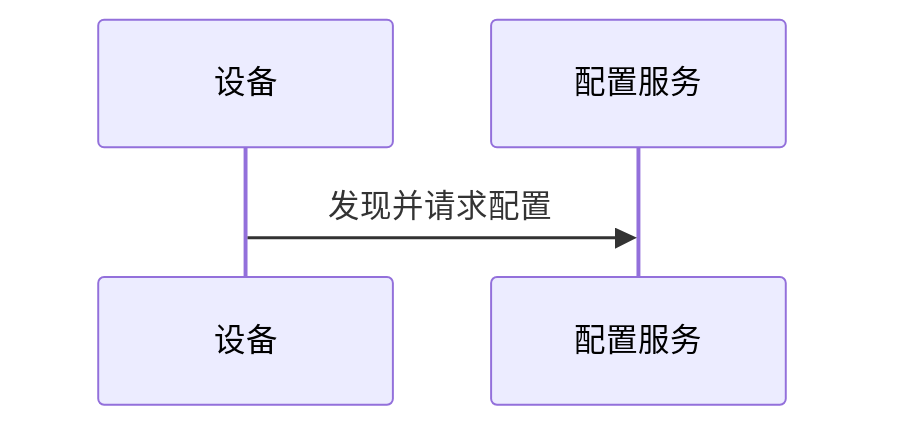

# 旧 Markdown -> WordDOM 链路审计

## 1. 审计目的与边界

本审计保留旧 Markdown -> WordDOM 链路的通用行为基线及截至 2026-07-20 的 **Desktop MVP 0.5.0 迁移状态**。来源目录、组织标识、业务文件名和私有样例内容已从公开说明中移除；旧资料不是运行时依赖。

只有第 10 节明确标为已实现并有证据的能力，才能视为当前 C# 链路已落地。历史验收与本次检查分开记录，不将脱敏后的示例名称冒充历史原始样式名。

## 2. 两类旧链路的角色

| 来源类别 | 行为差异 | 迁移价值 |
|---|---|---|
| 默认样式链路 | 使用统一内置 CSS | Pandoc/Lua、HTML 归一化、Word COM 与模板装配的基本路径 |
| 自定义样式链路 | 支持模板配套 CSS 与显式角色映射 | 自定义标题、正文、列表、图注及代码样式的兼容基线 |

两类链路不能视为完全相同；迁移时以支持自定义样式的行为为主线，同时保留默认样式的通用能力。原始资料不进入源码或发布包。

## 3. 模板与 CSS 映射

模板必须具有有序的正文起止书签；封面和版本表书签按实际输入启用。仅文件名相同不能证明模板有效，也不能证明 DOCX 与 CSS 配对正确。

以下是合成示例名称，用于说明自定义映射，不要求用户模板采用这些名称：

- 正文、表格正文、行内代码及无序列表 -> `示例 正文`
- 有序列表 -> `示例 有序列项`
- H1/H2 -> `示例 标题1` / `示例 标题2`
- 图注 -> `示例 图示`
- 代码块 -> `示例 代码`

默认 CSS 主要映射到 `正文`、`图注`、`CodeBlock`；有序和无序列表都通过通用列表选择器落到 `正文`，数字或项目符号继续由 Word 原生编号属性承载。这说明 CSS 不是独立主题文件，也不承诺把任意网页 CSS 属性创建成新的 Word 样式，而是可选的“HTML 语义角色 -> `mso-style-name` -> 模板既有 Word 段落样式”覆盖层。CSS 未声明的角色由模板 Word 原生样式补齐；显式声明先尊重 style ID、名称与 alias 的精确候选，精确候选不存在时允许唯一解析到 Word 内建样式中英文等价名，例如 `正文` 到 `Normal`。更换 DOCX 或 CSS 后必须重新校验整组配置。

注意：Word 内建样式可能以本地化名称或内部 style ID 表示。正式校验不能只做 XML 字符串相等，需按样式 ID、名称和 Word 可解析名称综合判断。初始模板校验与 Word 保存后重绑定必须共用相同的中英文内建名称等价组；两阶段均先采用精确候选，只有精确候选不存在时才尝试等价名，不能把自定义 `正文1` 当作 `正文`。模板预检得到的 ID 也不能直接跨越 Word COM 保存边界：Word 可能把 `MD2WordCaption` 等 ID 重编号或合并为当前文档的内建样式。新链路在关闭 Word 后重新索引成品 `styles.xml`，按原 ID、名称、alias 及等价中英文内建名称重绑定所有角色；找不到或有多个候选时拒绝发布，避免图注等段落的 `w:pStyle` 悬空后显示为正文。

## 4. 当前 CLI 与处理顺序

自定义样式链路 WordDOM 入口：

```text
python <skill>/scripts/build_docx_worddom.py <source.md>
  --docx-output <output.docx>
  --template-docx <template.docx>
  --style-css <profile.css>
  --toc-depth 3
  --mermaid-mode auto|off|required
  --mermaid-format png|svg
```

其他现有参数：`--output-dir`、`--html-output`、`--disable-number-sections`、`--html-only`。

已核实的主流程：

1. 读取 Markdown YAML front matter。
2. 调用 Pandoc，并依次应用 admonition、表格列宽、标题层级和图号 Lua filter。
3. 把 CSS 转为 Word 可导入的 inline style，归一化正文、列表、表格、代码块、内部锚点和本地资源。
4. 发现 Mermaid 时通过 `npx --yes @mermaid-js/mermaid-cli` 生成 hash 命名的 PNG/SVG，并替换代码块。
5. Word COM 隐藏打开 HTML，生成中间内容 DOCX。
6. 模板模式先复制模板，再把中间正文写入 `MANUAL_BODY_START` 与 `MANUAL_BODY_END` 之间；封面、版本记录、目录和固定尾部继续由模板主导。
7. 在最终模板上下文应用标题/编号、代码样式、表格宽度与字段更新并保存。
8. 重开最终 DOCX，只在正文书签范围内收口图片、重复表头和本地链接图片嵌入。
9. 解包 DOCX 做 Open XML 后处理，清理代码块、正文、列表和重复表头的直接格式。
10. `finally` 中关闭文档、退出独立 Word Application、反初始化 COM 并删除中间 DOCX。

无模板模式也会先保存再重开最终 DOCX，原因是 HTML 导入态的图片尺寸修改不能稳定持久化到最终文件。

## 5. 运行依赖

| 依赖 | 旧链路用途 | 新架构处理 |
|---|---|---|
| Python 3 | 总编排、HTML 归一化、COM 和 ZIP/XML 后处理 | 由 .NET 8 C# Worker 分阶段替代 |
| PyYAML | front matter | C# 使用严格 YAML 解析并保留历史键语义 |
| BeautifulSoup | HTML DOM 归一化 | 选择成熟 .NET HTML DOM 库，先做等价测试 |
| pywin32 | `DispatchEx("Word.Application")`、COM 生命周期 | Office PIA / COM interop，STA 线程 |
| Pandoc | Markdown -> standalone HTML | 第一版保留外部 Pandoc，诊断版本与路径 |
| Lua filters | admonition、列宽、标题映射、图号 | 原样打包并版本锁定，先不改写为 C# |
| Microsoft Word 桌面版 | HTML 导入、模板装配、字段/TOC 与最终 Word 收口 | 正式版必需依赖 |
| Node.js/npx + Mermaid CLI | Mermaid -> PNG/SVG | Electron 自带 Node 不等于自动有 npx；Main 必须同时解析 npx 与本机 Edge/Chrome，新链路固定 `@mermaid-js/mermaid-cli@11.16.0` |
| Open XML ZIP/XML | 最终直接格式与表头等收口 | 使用 Open XML SDK，并保留作用域限制 |

## 6. Markdown/front matter 契约

当前技能文档和脚本涉及：

| 键 | 行为 |
|---|---|
| `title` | 有值时替换 `MANUAL_COVER_TITLE`；缺失时保留模板原文 |
| `subtitle` | 有值时替换 `MANUAL_COVER_SUBTITLE`；缺失时保留模板原文 |
| `heading_base_level` | 由标题层级 Lua filter 使用 |
| `heading_numbering` | 全局标题编号开关，默认开启 |
| `heading_numbering_start_base` | 从第几个起始层级标题开始编号，默认 1 |
| `word_heading_numbering` | Word 多级编号格式配置，支持 level1..level4 |
| `word_repeat_table_headers` | Word 重复表头开关，默认 true；模板模式只作用正文书签区 |
| `figure_captions` | 图注与编号全局开关，默认 true |
| `manul_version_tables` | 按 `bookmark + column_keys + rows` 填模板表格 |

`manul_version_tables` 是既有拼写，虽然看似少了一个 `a`，迁移时必须兼容。若将来提供正确拼写，只能先作为别名并定义冲突优先级，不能静默破坏旧 Markdown。

### 6.1 Mermaid 图注输入契约

````markdown

<!-- caption: 设备发现与网络配置系统架构时序 -->
````

正式契约以 `caption` 为规范拼写，并兼容旧链路曾使用的 `cation`。新链路只在注释是 Mermaid 代码块后的下一个非空白节点时绑定；两者之间只能有空白，正文、HTML 元素或其他注释都中断绑定。旧脚本曾把较松散的全局 caption 注释后置转换为 `p.manual-figure-caption`，无法可靠证明归属并可能产生孤立图注；改为严格相邻绑定是本次明确收紧的兼容边界。

成功绑定后生成 figure/image/figcaption；图注既作为图片替代文本，也作为 Word 图注纯文本。无图注 Mermaid 成功时只生成图片。渲染完成后才统一运行图号 filter，因此普通带图注图片与成功且带绑定图注的 Mermaid 按文档顺序获得 `图 X.Y 标题`，失败后保留的代码块不占图号。图注经 `figcaption` / `p.manual-figure-caption` 的 CSS `mso-style-name` 映射到模板 Caption/“图注”等既有段落样式；`figure_captions: false` 关闭图注和图号。

版本表规则：

- 元数据缺失/空时跳过，不要求模板存在版本表书签。
- 一旦显式声明某表，模板必须有对应书签，且书签范围恰好包含一张表。
- 表格列数/列宽由模板决定；`column_keys` 只定义写入顺序。
- 单元格换行落为 Word 手动换行，不创建额外行。

## 7. 不能丢失的兼容行为

### 模板与范围

- 正文只替换两个正文书签之间的范围，不能改坏封面、固定图片、版本表、目录或尾部。
- 标题/副标题书签只能包文字；若范围连同 Shape，一次 `Range.Text` 替换可能删除封面对象。
- 模板与输出必须是不同文件；永不原地修改用户模板。

### 样式与内容

- CSS `mso-style-name` 显式覆盖 HTML 语义角色的目标模板样式；CSS 未覆盖时使用模板 Word 原生回退。自定义样式必须与对应 CSS 成组使用，但空 CSS 也必须生成可编辑、无 HTML 段落样式泄漏的 Word 原生文档。
- Markdown `1.` 与 `-` 必须在 HTML 归一化阶段分别标记为有序/无序角色，在 Word/Open XML 收口阶段再按 `w:numFmt` 重绑目标 `w:pStyle`。合成示例分别是 `示例 有序列项` 与 `示例 正文`；默认 CSS 两者均为 `正文`。收口必须保留 `w:numPr` / `w:ilvl`，不能把数字或项目符号降级成正文字符。
- Word 会在 Open XML 角色标记清理前更新模板目录；收口阶段除正文书签范围内的样式处理外，还必须只清除固定模板区域及目录缓存中的残留角色标记，不能把正文样式误应用到目录或其他固定内容。跨页表格还可能把一个标记拆到多个 `w:t` / `w:r`，并在标记中间插入 `w:lastRenderedPageBreak`；清理必须跨 run 匹配且保留该分页节点。
- H1-H6 与代码块最终由模板段落样式主导并清除导入直接格式；正文、列表、图题、表题、表格单元格、admonition 和图片段也必须清除角色标记、标记字符样式引用及 `manual-*` 临时段落样式。收口后仍有标记前缀或 `md2word-role-marker` 引用时必须稳定失败，不能发布带内部实现文本的 DOCX。粗体、斜体和超链接保留 Word 字符级语义；行内代码仍是 run 级范围，但须清除 HTML Code 字符样式并应用 CSS 显式目标或正文角色回退。
- 表格包含两列比例、多列紧凑列、边框、单元格段落和重复表头等多层规则，不能只比较文本。
- 内部链接会生成 ASCII 安全书签并重写锚点。

### 图片与 Mermaid

- 图片上限按实际 section 版心减去段落左右缩进动态计算，保持宽高比；C# Word COM 收口对触发判断和结果验收统一使用 1pt 容差，避免已经贴合版心的图片因 `ScaleWidth` 近似百分比回写而被反向放大。
- 模板模式图片二次收口必须限制到正文书签区，不能误伤模板固定图片。
- 本地链接图片最终设置随文档保存并断开外链，使成品自包含。
- Word 可能把 HTML 中已经 URL 编码的非 ASCII 本地文件名再次转义，并为无法读取的目标保存一个不可可靠缩放的占位图。新链路只对通过本地路径、大小和图片格式校验的目标恢复一层编码，再以 Word 原生内嵌图片替换占位图；替代文本/标题随后由 Open XML 恢复，临时定位书签在发布前清除。
- 图片所在段落不能继承模板正文的固定行距，否则 DrawingML 尺寸虽正确，Word 仍可能只显示一个固定高度横条；正文 figure 图片段须写入可自动扩展的单倍行距。
- Mermaid 默认 `auto + png`；新链路中 `auto` 单图失败告警并保留该代码块及相邻注释，其他成功图继续生成；`required` 任一图失败终止且不发布成品，`off` 不启动渲染并保留代码。
- Mermaid 资源使用源内容 hash 命名；PNG 采用适合 Word 的较高渲染比例，写入待导入 HTML 时先以 `width="600"` 和 `width: 600px; max-width: 100%; height: auto` 约束显示宽度。当前 C# 链路随后按旧脚本语义保存并重开最终 DOCX，只在正文书签范围内按实际 section 版心减页边距和正段落缩进收缩随文图片，保持比例且不放大小图。

旧脚本直接调用未锁版本的 `npx --yes @mermaid-js/mermaid-cli`，缺少明确超时、取消、输出安全验证、浏览器下载控制和图内容网络阻断。新链路固定 `@mermaid-js/mermaid-cli@11.16.0` 与 `puppeteer@25.3.0`，清除继承的 Windows `__COMPAT_LAYER` 后优先复用本机 Edge/Chrome；只有系统浏览器启动被分类为 `MERMAID_BROWSER_LAUNCH_FAILED` 时，才显式准备对应 `chrome-headless-shell` 到应用私有持久缓存并重试一次。下载器固定携带 `proxy-agent@6.5.0` 以遵循主机代理，安装失败/15 分钟超时有稳定错误码。普通渲染使用 strict 安全级别和不可达本地代理，限制每任务 64 图、单图源 256 KiB、图注 4096 字符、输出 20 MiB、单次渲染 180 秒。PNG/SVG 通过格式与安全校验后才原子采用；网络获取只涉及固定工具包/受管浏览器，不上传 Markdown、模板、图片或 Mermaid 图源。

### 已知限制

- `word_repeat_table_headers: false` 现会在正文书签范围内结构化移除全部 `w:tblHeader`；复杂合并单元格在不同 Office 版本中的分页视觉仍需单独比较。
- Mermaid 当前实现不代表所有图类型都已完成视觉验收。
- HTML/CSS 到 Word 的导入行为受 Office 版本影响，环境版本必须进入基准记录。

## 8. C# 移植基准与验收

正式移植前，在旧目录外的私有测试位置准备最小但覆盖充分的 Markdown 与模板组合；不要提交真实样本到本仓库。

基准矩阵至少包括：

1. 使用说明书 + 默认 CSS。
2. 技术报告 + 专属 CSS。
3. 有/无 title、subtitle 与版本表数据。
4. 默认编号、自定义多级编号、关闭编号与不同起始层级。
5. 正文、`-` / `*` / `+` 无序列表、`1.` 有序列表、分离列表重启、二至三级嵌套与有序/无序混合、列表项多段落、admonition、代码块、内部链接。
6. 两列表、多列表、长字段、复杂合并单元格与重复表头开关。
7. 大图、列表内图片、本地链接图片、图注开关。
8. Mermaid auto/off/required 与 png/svg，包含一个故意失败的图。
9. 取消、Word 不可用、Pandoc 不可用、模板书签缺失、CSS 样式缺失。

每个样本保存以下私有证据：旧脚本/依赖/Office 版本、CLI 配置、最终 DOCX、关键页面 PDF 或截图、书签/样式/媒体/外链/字段结构检查结果。C# 版本必须逐项比较，不只比较文件存在或段落文本。

## 9. 迁移建议

- 以 自定义样式链路 增强脚本为行为主线，用 默认样式链路 检查没有被意外丢失的通用能力。
- 先保留 Pandoc 与 Lua，优先迁移进程、模板库、协议、COM 生命周期和 Open XML；避免同时重写所有层。
- 将模板校验做成独立 Worker 命令，导入与转换前都可复用。
- 为每个旧行为建立测试或人工证据后再改写；发现更好实现可以采用，但兼容差异必须写入本文并由用户确认。
- 不把旧目录或仓库内容整理成运行时模板库；正式用户通过应用导入自己的 DOCX/CSS。仓库内 `resources/templates/*` 只保存明确可公开的完整合成模板包（包级 `index.json` + 索引模板目录），Portable 打包时逐一经 Worker 校验并原样复制登记文件，不再合成另一份索引；完整 validation/styleMappings 在加载时重新计算，不持久化第二份 profile JSON。使用自定义模板时把仓库外完整私有模板包手工复制为 EXE 同级 `templates/<package-name>`，不要求固定中间目录，也不让私有资产进入构建上下文。

## 10. Desktop MVP 0.5.0 迁移状态

### 10.1 已实现并有合成证据

| 旧行为/边界 | 0.5.0 实现 | 当前证据 |
|---|---|---|
| DOCX + CSS 成组管理 | Electron Main 把界面导入规范化为固定 `template.docx` / `style.css` 并写入 `templates/user/<id>`，遍历 `templates/*/index.json` 合并公开参考、手工私有和用户包；每包只保留精简 version 2 索引，启动时重新校验并在内存恢复完整映射，旧 version 1 索引只读兼容。转换创建不可变快照并核对 fingerprint；跨包重复 ID 或多个默认模板拒绝加载 | TypeScript 存储、运行路径、回滚、路径边界、精简单索引/旧索引兼容、多包发现/冲突、完整公开源码包逐包校验/白名单复制，以及公开 + 手工私有包 packaged 启动检查 |
| 安全桌面分层 | Renderer 只持有 handle；preload 窄接口；Main 校验 IPC 并串行启动独立 Worker；Word 只在 C# STA 中运行 | 安全、IPC、队列和 Worker 客户端测试 |
| 能力声明可追溯 | 版本化 `capabilities.json` 汇总已实现语法/Front Matter/模板契约、条件和未完成边界；Worker 深校验并通过只读协议返回，页面和生成式离线说明复用同一清单。模板问题用 `capabilityId` 关联说明。该变化不扩大 WordDOM 兼容声明 | Worker/TypeScript 清单校验、重复 ID 拒绝、协议 smoke、页面搜索/深链、生成文档漂移检查与 packaged E2E |
| Pandoc 语义 filter | `shared-admonitions.lua`、`worddom-schema-table-width.lua`、`shared-heading-remap.lua`、`shared-figure-numbering.lua` 受控打包；前三个先生成语义 HTML，Mermaid 渲染后再单独运行图号 filter，使失败代码不占号 | manifest/hash/order 测试，以及 admonition、两列宽度、标题映射、普通图片/Mermaid 混合图号测试 |
| admonition 基础 Word 视觉 | HTML 归一化为每个普通 admonition 段落写入非公开类型标记，按 `danger > warning > caution > note > generic` 解析最近容器；Open XML 先保留并重绑 CSS/Word `w:pStyle`、清理导入直接格式，再只追加固定背景和 `single` 2.25pt、`space=0` 左边框。多段引用不合并，嵌套列表/表格/代码不着色 | 中英文标签与普通引用 Lua/HTML 测试、类型优先级/非公开角色测试、Open XML 配色/作用域/无几何和字体覆盖断言、真实 Word 保存后结构用例 |
| CSS `mso-style-name` 与 Word 原生回退 | 解析正文、有序/无序列表、H1-H6、图题、表题、代码块、行内代码、表格单元格、admonition 和图片段；CSS 显式映射先按 style ID、名称和 alias 精确解析，精确候选不存在时按共享的中英文内建样式等价组唯一解析，未配置角色从模板内建/默认段落样式回退并报告 `word-fallback`；模板缺少未映射标题级别时先报告条件性 warning，Pandoc 标题重映射后只对实际使用且未解析的 `h1..h6` 阻止转换；Word 保存后按当前样式表重新绑定所有角色，保证生成 `w:pStyle` 有现存定义；行内代码无显式映射时继承正文目标，跨 run 清除 `HTML Code`/`HTML 代码` 并投影目标字体；角色标记同样跨 `w:t` / `w:r` / `w:lastRenderedPageBreak` 清理且保留分页提示，残留时拒绝发布；收口后移除临时段落样式和导入直接格式 | 模板校验/协议测试、源 HTML 标题契约测试、样式 ID 重编号/缺失失败单元测试、真实 Word 图注重绑定、Open XML 跨 run/分页提示/样式清理断言、空 CSS 真实 Word 端到端测试、技术报告模板逐页检查及使用说明书私有样例 |
| 普通 fenced 代码块 | Pandoc `pre` 转换为单个目标代码段落时，将源换行/空行显式写为 Word 手动换行；行首与连续空格使用不可折叠空白，tab 按四空格基线展开 | HTML 归一化断言、Open XML `w:br` 断言、真实 Word 逐行文本及技术报告模板 Word/PDF 视觉检查 |
| Mermaid 与相邻图注 | fenced `mermaid` 通过固定 CLI/Puppeteer 和本机 Edge/Chrome 生成 PNG/SVG；清除兼容层继承标记，启动失败时显式准备受管浏览器并重试；严格相邻 `caption` / `cation` 绑定为 figure，成功且带图注时统一编号；导入前拆成独立居中图片段与独立图题段并映射模板图题样式 | 启动错误分类/受管回退单元测试、HTML 分段测试、真实 Edge PNG/SVG、Word drawing/图题相邻结构及逐页视觉用例 |
| 模板正文装配 | 专用 Word 实例把导入 HTML 的正文复制到 `MANUAL_BODY_START` / `MANUAL_BODY_END` 之间并恢复书签；Open XML 收口保留结束书签宿主边界段，发布前验证两书签唯一、成对、有序 | 边界段/书签契约单元测试、目录缓存残留回归测试与真实 Word 端到端用例 |
| 内部链接 | HTML 归一化只为被引用且实际存在的 `id` 插入确定性 `md2word_bm_######` ASCII 命名锚点，并把同目标链接归并到一个 Word 书签；Word 保存后校验生成链接与书签一一可解析，失败以 `INTERNAL_LINK_FINALIZATION_FAILED` 阻止发布 | HTML 重写/冲突/缺失目标单元测试、Open XML 成品校验测试、真实 Word 合成用例，以及自定义模板的 Open XML 与 Word COM 历史检查 |
| front matter 封面/版本表 | Pandoc JSON 严格读取显式 `title`、`subtitle`、历史键 `manul_version_tables`；缺失值保留模板，显式值要求相应能力；版本表保留表头并按 `column_keys` 重建行，单元格换行为 Word 手动换行 | 元数据读取和 Open XML 模板元数据测试 |
| Word 原生列表 | HTML 为 ordered/unordered、tight/loose、列表内代码/图像上下文添加角色标记；Open XML 按 `w:numFmt` 选择 CSS 样式，保留起始号/重启/混合层级；有序目标样式自带编号时采用模板同级编号文本与缩进，无序目标样式无编号时采用 Word 项目符号库的 `Wingdings ● / ■ / ◆` 和计算缩进；派生编号使用独立身份，continuation 抑制样式伪编号 | 结构矩阵、符号字符/字体/缩进、派生 `w:nsid` / `w:tmpl` 测试、启用 Word COM 的合成端到端测试、手工项目符号库及重新应用样式计算值比较 |
| front matter 标题编号 | 严格解析编号配置；先应用模板标题样式并重置 HTML 导入直接段落/字体格式，再创建原生四级多级列表、统一标题 `numId`，普通列表收口跳过标题角色 | 默认/自定义/非法元数据测试、正文穿插标题回归、真实 Word 四级 `numbering.xml`/直接格式/目录断言，以及仓库外模板检查 |
| front matter 重复表头 | `word_repeat_table_headers` 默认开启；开启时规范化正文每表首行为唯一 `w:tblHeader`，关闭时清除正文所有表头标记，正文书签外模板表格不变 | Open XML 作用域与开关测试、真实 Word 长表端到端测试，以及仓库外两套本地模板续页检查 |
| 普通与规则合并表格基础布局 | 正文书签内无合并表格固定为 section 版心宽度，两列按 Lua 审计契约写入 24%/76% 的 `w:tblW` / `w:tblGrid` / `w:tcW` 与 fixed layout；逻辑网格规则的 HTML `rowspan` / `colspan` 保留 `w:vMerge` / `w:gridSpan` 与 AutoFit 比例并固定版心。两类表格均清除表/行级 cell spacing 和单元格直接边框，写入连续 0.5pt 黑色网格、4/6pt 内边距、垂直居中、0 首行缩进/单倍行距及表头居中加粗；顶层相邻表格间的结构性空段落清除隐藏/直接格式并引用 CSS 正文样式，不创建新样式；不规则网格保持原结构 | 作用域、纵横合并保留、逻辑网格/不规则跳过、表/行级间距、空段落样式和 Open XML 校验测试，真实 Word 合并 HTML/相邻表格用例，以及模板逐页 Word/PDF 检查 |
| 正文随文图片嵌入与尺寸收口 | 恢复 Word 二次转义的非 ASCII 本地 URI，以 Word 原生内嵌图片替换占位图并保留替代文本/标题；保存并重开最终 DOCX，只在正文书签内按 section 页面宽度减左右页边距和正段落缩进等比缩小，不放大小图或修改模板固定图片；触发与结果检查共享 1pt 容差，避免近似 `ScaleWidth` 百分比回写放大已贴合版心的图片；figure 图片段使用自动扩展行距 | URI 解码/拒绝远程目标/元数据与书签清理单元测试、容差边界测试、超宽合成图片真实 Word 端到端结构断言，以及仓库外使用说明书和技术报告样例检查 |
| 输出/COM 清理 | Worker 验证临时 DOCX 后原子写入任务结果，Main 再原子发布；文档与 Word 显式关闭，只有确认归属的专用 Word PID 可兜底结束 | 原子文件、真实 Word 用例和进程退出检查 |

列表专项已经覆盖 `-` / `*` / `+`、非 1 起始的有序列表、二至三级有序/无序混合、从嵌套返回父层、tight/loose、多段落 continuation、列表内代码、列表内合成图片上下文、分离有序列表重启和起始号继承。断言同时检查 `w:pStyle`、`w:numFmt`、`w:lvlText`、符号字体、`w:numPr`、`w:ilvl`、`w:numId`、缩进、模板级别替换与派生编号身份；代码/续段不伪装成新的编号段落，列表外段落不被误改。合成测试继续检查模板编号替换、正首行缩进基点和 Word 原生项目符号几何；样式名仅为示例，不构成硬编码契约。

截至 2026-07-20，C# Worker 常规门控为 125 通过/11 个真实环境用例跳过；显式开启 Word COM 与真实 Mermaid CLI 后 136/136 通过，并确认任务结束后无残留专用 WINWORD。新增用例覆盖 CSS `正文` 唯一解析英文内建 `Normal`，以及真正存在同名自定义样式时精确候选优先。五类 admonition 用例覆盖中英文标签、普通引用、类型优先级、非公开内部标记、准确背景/2.25pt 左线、无几何/字体覆盖，以及 Word 再保存后的持久性。空 CSS 用例证明 Word 原生回退，显式样式必须另以模板配套 CSS 验证。私有样例的内容、页码、内部样式名和具体统计不保留在公开记录中。

0.5.0 的能力说明增量另于 2026-07-20 通过 95 项 Vitest、Worker 常规门控 126 通过/11 跳过、包含 `describe-capabilities` 的协议 smoke、四页 Electron E2E、8 张截图和目录版 packaged E2E。同日后续复杂合成专项在当前 0.5.0 代码上实际重新开启 Word COM 与 Mermaid CLI 全门控，得到 137/137 通过、0 跳过；运行时合成的 9 页成品通过 30/30 项 DOCX/PDF 审计。模板原生正文对与 DOM 导入正文对在 Word COM 中的页内距离均为 26.70pt，在 Word 原生 PDF 中分别为 26.76pt 与 26.64pt，差 0.12pt；导入正文无直接 spacing/indent/alignment，正文顶层仅保留 2 个相邻表格结构分隔段。可见 HTML/角色标记、`w:altChunk` / `afchunk`、HTML/临时样式、外部关系、浮动 anchor、文本框和旧式 `w:pict` 均为零，289 个样式引用全部解析。56 行长表在第 4–7 页重复表头，4 张图片均内嵌并在版心内；重复转换指标一致，Mermaid `auto/off/required` 均符合失败与发布契约，真实桌面 IPC 转换复跑通过且最终无本次新建的 WINWORD。该证据仍不替代不规则网格、高级合并列宽、高级图片布局、丰富 admonition 或完整 WordDOM 的最终逐项比较；完整命令与报告口径见 `doc/testing/comprehensive-synthetic-acceptance.md`。

### 10.2 部分实现，不得写成完整兼容

- **admonition**：Lua 已把约定前缀转换为语义结构；五类固定背景与 2.25pt 左线基础视觉已在不改 CSS/Word 段落样式几何和文字格式的前提下实现。图标、文字色、内边距、圆角、整框、连续多段盒子及跨模板/跨 Office 完整视觉仍未签收。
- **表格**：Lua 已输出审计过的两列 24%/76% 宽度意图；Open XML 已把正文无合并普通表固定到 section 版心并写入相同比例，同时完成重复表头、连续边框、cell spacing 清理、内边距、垂直对齐和普通单元格段落收口。规则矩形 HTML `rowspan` / `colspan` 现在也会保留纵横合并标记，以 AutoFit 比例完成相同版心/边框/间距/单元格段落收口。相邻独立表格之间保留 Word 所需的空段落，但移除导入隐藏/直接格式并直接使用 CSS 解析后的正文样式，不生成专用分隔样式。不规则网格、多列复杂比例、合并表格高级固定列宽及跨 Office 复杂表视觉尚未迁移完成。
- **图片/本地资源**：Worker 会按 Markdown 所在目录解析相对资源并把本地图片嵌入成品；正文随文图片已完成动态版心缩小和模板固定区域隔离。浮动 Shape、文本框、多栏、复杂表格单元格实际宽度、裁剪/环绕/边框和跨 Office 视觉尚无完整证据。
- **标题与图号**：Lua 的层级映射、Word 原生四级编号、编号开关/起点/格式和按章图号已接入；完整目录/字段及不同 Office 版本的全量模板视觉仍需基准对比。
- **封面/版本表**：显式 front matter 的 Open XML 更新已实现；尚未用私有模板验证复杂 Shape、特殊单元格格式和所有历史数据组合。

### 10.3 尚未实现/验证

- Mermaid 已具备 PNG/SVG、相邻图注、统一图号和安全失败基线，但全部 Mermaid 图型、复杂 SVG、不同 Office 版本及两套私有模板的逐页视觉一致性尚未签收。
- 浮动 Shape、文本框、多栏、复杂表格单元格图片宽度，以及裁剪/环绕/边框等高级图片布局收口。
- 多列复杂比例、不规则网格和合并表格高级固定列宽的 Word/Open XML 收口，以及复杂表跨 Office 视觉一致性。
- 两套私有基准模板的逐页 Word/PDF/截图视觉对比，以及完整 WordDOM 行为签收。

`resources/conversion/capabilities.json` 是当前能力声明的机器可读单一真源；schema 1.1 同时供 Worker `describe-capabilities`、上位机“能力说明”和 `resources/docs/MD2Word-支持能力说明.md` 生成脚本使用。产品版本必须与 `package.json` 一致，公开能力 ID 全局唯一。只允许在对应实现与测试证据同时落地后，把项目从 `pendingLegacyParity` 移入 `implemented`；页面或离线文档不得绕过该规则单独宣称能力。
