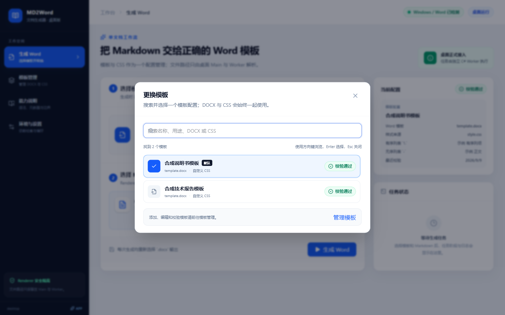
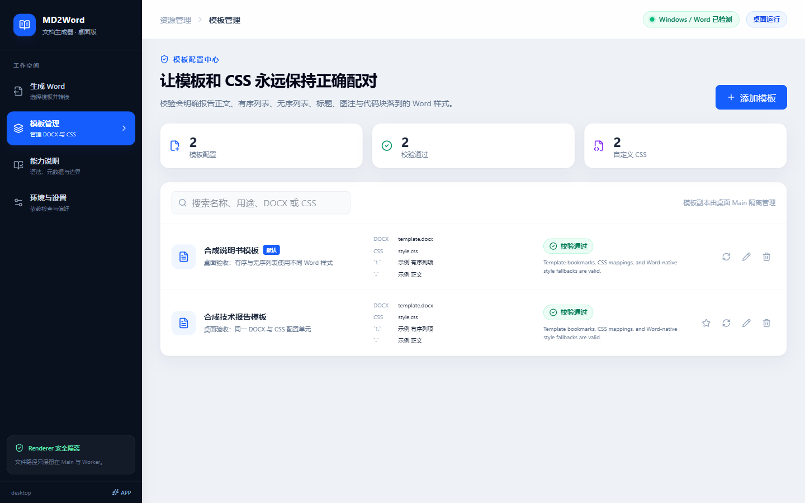
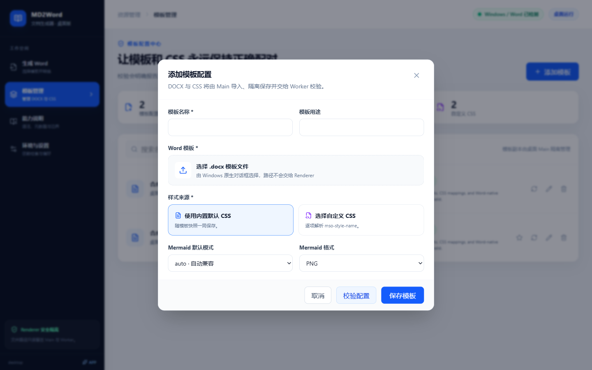
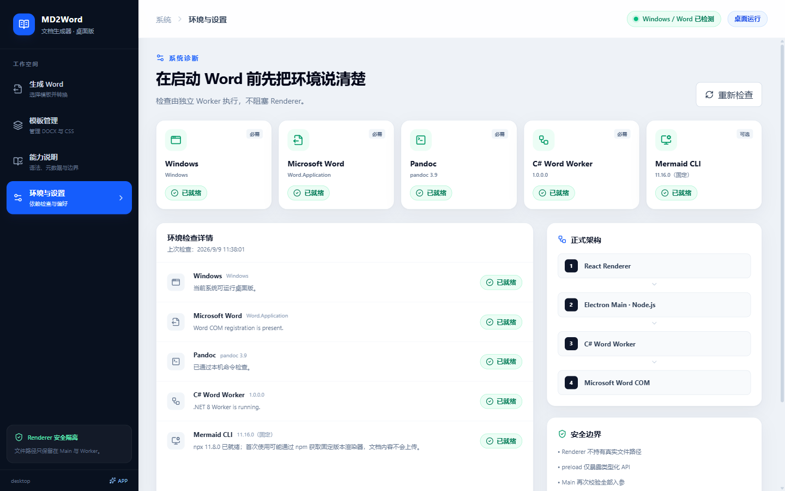
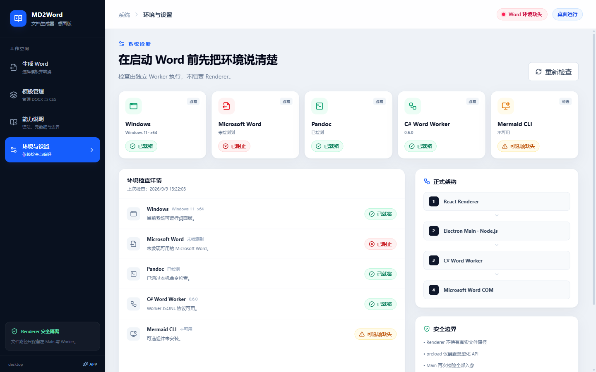

# UI 与桌面验收说明

## 目的与运行边界

当前里程碑是 **Desktop MVP 0.6.1**。同一套 React 页面通过 adapter 选择运行后端：

- Electron 中使用真实 preload、Main、模板库、原生对话框、C# Worker、Word COM 和受控 shell 动作。
- 普通浏览器中使用 mock adapter，保留 UI 预览、合成模板、本地存储和模拟任务；不会生成 DOCX。

界面会显示“桌面版/桌面运行”或“原型/交互原型”。浏览器 mock 的选择、校验、环境、转换、打开文件和定位目录均为模拟；Electron 中相应动作是真实本机能力，但仍受 0.5.0 的转换兼容范围限制。

### 桌面转换边界

0.5.0 已接通模板/CSS 校验、正文书签装配与成品契约验证、内部链接 ASCII 安全书签重写及成品匹配校验、四个 Lua filter、admonition 固定背景/2.25pt 左线、封面/版本表 front matter、模板样式主导的 Word 原生四级标题编号、正文重复表头开关、CSS 显式样式与 Word 原生回退、Word 保存后 style ID 重绑定、行内代码 run 映射、普通代码块换行/空行/缩进保留、原生有序/无序列表收口、普通无合并及规则矩形合并表格连续网格/单元格段落、相邻表格空段落的 CSS 正文样式恢复、正文随文图片动态版心缩小、非 ASCII 本地图片 URI 恢复和图片段自动行距，以及 Mermaid PNG/SVG 本地渲染、浏览器启动回退、相邻图注绑定和统一图号。0.5.0 还新增由 Worker 返回的版本化能力清单、可搜索的“能力说明”页面、模板问题深链和随包离线说明；这些说明不扩大下述转换兼容边界：

- Mermaid 的正式结构/失败基线已实现，但全部图型、复杂 SVG 和不同 Office 版本的逐页视觉一致性仍待私有模板验收。
- 表格已支持正文跨页重复表头开关；无合并普通表固定到 section 版心，两列按 Lua 审计意图收口为 24%/76%；规则矩形 HTML `rowspan` / `colspan` 保留 Word 纵横合并和 AutoFit 比例，并完成相同版心、连续单线边框、cell spacing 清理、4/6pt 内边距、垂直对齐和紧凑单元格段落。正文顶层相邻表格间的必要空段落会清除 Word 导入隐藏/直接格式并直接引用 CSS 正文样式，不新增分隔样式。多列复杂比例、不规则网格、合并表格高级固定列宽及跨 Office 复杂表视觉未完成。
- 相对本地图片已嵌入成品，Word 二次转义的非 ASCII 本地文件名可在安全校验后恢复；正文随文图片只在正文书签范围内按版心等比缩小，尺寸触发与结果检查共享 1pt Word 布局容差，图片段使用自动扩展行距避免固定正文行距裁切。浮动图片、文本框、多栏、复杂表格单元格、裁剪/环绕及跨 Office 最终版式未完成专项验收。
- admonition 的五类固定背景/左线已实现；图标、文字色、内边距、圆角、整框、连续多段盒子等丰富布局、完整目录/字段和全量 WordDOM 视觉一致性仍待私有基准比较。

成功卡会显示 Worker 返回的兼容警告。生成出可读 DOCX 不代表上述能力已经完成。

## 页面

| 页面 | 桌面验收重点 |
|---|---|
| 生成 Word | 模板摘要保持紧凑；Markdown/输出只用 handle；真实阶段、取消、警告和结果在跨页后仍可见 |
| 模板管理 | DOCX/CSS 成组导入、Worker 校验、CSS 显式映射/Word 原生回退来源、warning 二次确认、默认模板和原子存储 |
| 能力说明 | 当前安装 Worker 的产品/清单/协议版本；语法、Front Matter、模板契约、限制和环境四类信息；搜索与模板问题深链 |
| 环境与设置 | Word/Pandoc/Worker 必需项与 Mermaid npx + 本地 Edge/Chrome 可选项区分；真实重新检测和受控打开模板库 |

详细布局和文案规则见 [UI 规格](../requirement/ui-spec.md)。

## 推荐桌面验收路径

模板作者应先参照 [模板制作指南](../../resources/docs/MD2Word-模板制作指南.md)，完成 DOCX 书签、段落样式和 CSS 配对，再执行以下导入/转换验收。指南随打包复制到 EXE 同级，并在 `release` 根提供单文件版配套副本；已有 GitHub `v0.6.0` 附件不会被此文档修改自动覆盖。

1. 启动桌面版，确认侧栏显示“桌面版”、页头显示“桌面运行”，页面中不存在 `window.require` 或 Node 入口。
2. 在空模板库中添加一个只含合成内容的 DOCX，并选择内置或合成 CSS；检查 DOCX/CSS 由原生对话框选择且页面不显示真实路径。
3. 运行“校验配置”，检查正文、有序列表、无序列表、H1-H6、图题、表题、代码块、行内代码、表格、admonition 和图片段的目标样式及“CSS 已解析/Word 原生”来源；`invalid` 不能保存，`warning` 需再次确认。若模板只缺少 CSS 未映射的高阶标题样式，应显示条件性 warning；用两份合成 Markdown 分别确认标题重映射后未使用该级别时成功、实际使用时返回 `WORD_NATIVE_STYLE_FALLBACK_MISSING`。
4. 对任一带能力编号的模板问题点击“查看对应能力”，确认编辑窗口关闭、能力页切到正确类别并聚焦对应条目；再检查 Front Matter 搜索、模板书签/CSS 角色、限制和固定工具版本。
5. 选择或拖入一个运行时生成的合成 `.md`。点击“生成 Word”后先取消原生“另存为”，确认没有新增任务或日志。
6. 再次选择输出并完成转换，检查真实阶段、日志、兼容警告、“打开文件”和“在文件夹中显示”。
7. 用列表专项合成 Markdown 检查 `-` / `*` / `+`、非 1 起始有序列表、嵌套、loose 条目和分离列表重启；在 Word 中确认编号/项目符号可见、缩进合理、样式正确。若有序目标样式自带编号，读取生成态 `ListString`、字体、缩进、段距和行距，再重新应用同名样式比较；无序目标样式没有编号时，逐级比较生成态与 Word 手工项目符号库的字符、字体、标记位置和文字位置，均不能只核对样式名。同一合成 Markdown 应含多行 fenced 代码，核对手动换行数、空行、四空格缩进和内部双空格，不能只核对代码样式名。
8. 用合成 Markdown 写入普通带图注图片和 fenced `mermaid`，后者紧随 `<!-- caption: 设备发现与网络配置系统架构时序 -->`；分别检查 PNG/SVG、`cation` 兼容、非相邻注释不绑定，以及生成 Word 中的 `图 X.Y` 和模板 Caption/“图注”样式。Word 保存后须确认图注段 `w:pStyle` 指向当前 `styles.xml` 的现存定义，而不是只保留保存前 ID 后显示成正文。只有渲染成功且带绑定图注的图应占统一图号；逐页确认完整图题处于图片下方的独立居中段，而不是图号留在图片右侧。同一合成文档加入规则 `rowspan` / `colspan` HTML 表格，确认纵横合并不丢、出现正式连续边框而非仅灰色编辑网格线，并核对版心、AutoFit、cell spacing、内边距和单元格段落；再加入三张只由 Markdown 空行分隔的独立表格，确认两处必要空段落仅引用 CSS 正文样式、没有隐藏/直接格式或新样式定义，且 Word/PDF 中表格不粘连。
9. 用合成 Markdown 覆盖普通 `>`、中英文 note/caution/warning/danger、同类多段引用，以及引用中的列表、表格和代码；确认普通段落使用固定背景/2.25pt 左线且仍是 CSS/Word 解析样式，没有新增缩进、段距、行距、对齐或字体格式，嵌套结构保持自身角色，内部类型标记全部清理。
10. 分别检查 Mermaid `off` 保留代码、`auto` 单图失败保留对应代码并显示稳定告警、`required` 任一图失败且不产生部分成品；环境卡缺 npx 或本机 Edge/Chrome 时按模式阻止或降级。
11. 在转换中请求取消，确认先显示安全取消，最终不保留部分输出，任务结束后没有本任务残留的 WINWORD、Mermaid CLI 或浏览器子进程。
12. 进入“环境与设置”重新检查；Word、Pandoc 或 Worker 缺失时必须阻止生成，Mermaid 缺失只按当前模板模式影响任务。
13. 在 1440x900 与 1280x800 检查四页、模板选择弹层、warning、运行、成功、失败和取消状态，并重新生成 0.5.0 桌面截图。仅 Worker 成品视觉变化且 Renderer 布局/状态未变化时，无需更新现有页面截图。

只预览浏览器 mock 时，可以继续使用两个合成演示模板、模拟另存为、模拟失败/取消和“重置演示数据”；这些结论不能替代上述桌面验收。

## 运行与检查

GitHub 的标签发布与手动构建见 [GitHub 发布流程](../development/github-release.md)。CI 使用 Visual Studio 官方 Word PIA 编译，只运行不依赖 Word COM 的检查；本机真实转换与安装生命周期验收仍单独记录。

0.6.0 的 `package:win` 同时生成便携目录、ZIP、Portable EXE 和 Setup EXE。Setup 的安装、升级、用户模板保留和默认卸载验收命令见 [Setup 安装版验收](../testing/setup-installation.md)。Setup 使用用户数据目录中的模板库，便携版继续使用 EXE 同级模板库；以下 0.5.0 结果作为历史基线保留。

安装依赖：

```powershell
npm install
```

浏览器 mock：

```powershell
npm run dev
```

桌面开发版：

```powershell
npm run dev:desktop
```

完整检查入口：

```powershell
npm run typecheck
npm run lint
npm run test
npm run capabilities:check
npm run test:worker
npm run build:worker
npm run test:protocol
npm run build
npm run test:e2e

# 生成只有公开参考模板的基线包
npm run package:win
```

`package:win` 不读取私有目录，直接把 `resources/templates` 作为完整公开模板包容器，遍历每个子目录的精简 `index.json`，再经 Worker 校验索引登记的全部 DOCX/CSS。打包只把索引和登记文件原样复制到 `release/templates/`，不会再生成或重写 JSON，也不会复制源码说明或旁路文件；因此可手工加入另一个明确无业务内容的完整公开包。应用加载时重新校验 DOCX/CSS，模板目录不生成稳定 `profile.json`。同一流程先运行 `capabilities:check`，把由 `capabilities.json` 生成的 `MD2Word-支持能力说明.md` 放到目录版/ZIP 的 EXE 同级，并在 `release` 根保留一份供单文件版并列分发。使用自定义模板时把仓库外完整私有模板包直接复制为 EXE 同级 `templates/<package-name>/`，包名可自定义，也不再执行专用打包命令。应用遍历 `templates` 的直接子目录并读取各自 `index.json`；界面导入的新模板写入 `templates/user/`。开发态模板根仍位于 `userData`，私有包和所有 release 继续受 Git 排除。

真实 Word 用例默认跳过，需在已安装 Word 的 Windows 上显式开启；测试只使用运行时合成夹具：

```powershell
$env:MD2WORD_RUN_WORD_E2E = '1'
dotnet test worker\Md2Word.Worker.sln -c Release
```

真实 Mermaid CLI 用例还需可用的 npx 与本机 Edge/Chrome，并显式开启以下开关；完整 Mermaid -> Word 用例同时保留 Word 开关：

```powershell
$env:MD2WORD_RUN_MERMAID_E2E = '1'
$env:MD2WORD_RUN_WORD_E2E = '1'
dotnet test worker\Md2Word.Worker.sln -c Release
```

生成基线包后，直接对正式未压缩 Portable 目录执行 packaged 启动与唯一参考模板检查：

```powershell
$env:MD2WORD_RUN_PACKAGED_E2E = '1'
$version = (Get-Content package.json | ConvertFrom-Json).version
$env:MD2WORD_EXPECTED_TEMPLATE_ID = 'public-reference-template'
$env:MD2WORD_EXPECTED_TEMPLATE_COUNT = '1'
$env:MD2WORD_PACKAGED_EXE = (Resolve-Path "release\MD2Word-$version-win-x64-portable\MD2Word.exe").Path
npx playwright test --config playwright.electron.config.ts e2e/electron-packaged.spec.ts
```

在安装了 Word 的发布主机上，完整 packaged 转换还需执行：

```powershell
$env:MD2WORD_RUN_DESKTOP_WORD_E2E = '1'
$version = (Get-Content package.json | ConvertFrom-Json).version
$env:MD2WORD_E2E_EXECUTABLE = (Resolve-Path "release\MD2Word-$version-win-x64-portable\MD2Word.exe").Path
npx playwright test --config playwright.electron.config.ts e2e/electron-smoke.spec.ts
```

单文件 Portable EXE 是自解压启动壳，Playwright 不能直接连接其子进程，因此单独执行进程、主窗口标题和独立用户数据目录 smoke；完整 preload、Worker 和 Word 转换由 ZIP 解压版承担。

Mermaid 固定使用 `@mermaid-js/mermaid-cli@11.16.0` 与 `puppeteer@25.3.0`，清除继承的 Windows 兼容层标记后优先复用本地浏览器。系统浏览器启动失败时才显式准备受管 `chrome-headless-shell` 到持久缓存并重试一次；首次运行可能下载固定 CLI 包和受管浏览器二进制，但不会上传 Markdown、模板、图片或图源。测试应覆盖 PNG/SVG、安全限额、auto/off/required、浏览器启动分类、安装失败/15 分钟超时，以及成功带图注图片统一编号。

桌面验收还应确认：CSS 未配置时各角色使用模板 Word 原生样式；Word 保存后所有生成 `w:pStyle` 都能在当前样式表中找到定义，图注即使被 Word 重编号也仍使用“图注/Caption”而非正文。正文范围没有角色标记、`md2word-role-marker` 引用、`manual-*` 或 HTML/Pandoc 段落样式残留；跨页表格即使由 Word 在标记中插入 `w:lastRenderedPageBreak`，单元格也只能显示源正文，且分页提示数量不变。admonition 普通段落在保留目标 `w:pStyle` 的同时只增加对应 `w:shd` 和 `single` 2.25pt 左边框，不出现上/右/下边框或直接缩进、段距、行距、对齐、字体/字号；嵌套列表、表格和代码保持自身角色。标题无需手动重新选择样式即可显示模板字体/字号，编号标题共享一个 `numId`；有序列表的实际编号外观与目标样式一致，无序列表的符号/字体/缩进与 Word 手工项目符号库一致；代码块保留源换行、空行、缩进和连续空格；行内代码没有 `HTML Code`/`HTML 代码`，正文/表格范围显示正文目标样式，其他段落保持自身段落样式但使用目标正文计算字体；普通及规则合并表格为连续单线网格且单元格无首行缩进/两端对齐，规则合并表保留纵横合并并不再只有灰色编辑网格线；图题是图片下方的独立段落；超宽正文随文图片不超过版心且模板固定图片尺寸不变，含非 ASCII 文件名的本地图片不保留外部关系或临时恢复书签，图片段为自动扩展行距且 Word/PDF 中没有横条裁切；最终 `MANUAL_BODY_START` / `MANUAL_BODY_END` 唯一、成对、有序。

### 2026-07-20 已确认结果

- `npm run typecheck` 通过。
- `npm run lint` 通过。
- `npm run capabilities:check` 通过：清单产品版本与 `package.json` 一致，生成离线说明无漂移。
- `npm run test` 通过：23 个测试文件、95 项 Vitest，新增能力清单深校验、重复 ID 拒绝、页面 Front Matter 搜索、能力深链和四页导航覆盖，并继续覆盖弹窗根层挂载、页面状态、adapter、运行模板根路径、多模板包遍历、精简单索引、旧版索引兼容、完整公开源码包逐包校验/白名单复制、跨包 ID/默认冲突、模板 warning/Word 原生回退来源展示、`inline-code` 协议角色、Electron Main 安全/IPC/存储/队列/Worker 客户端等单元行为。
- C# Worker 0.5.0 已重新启用真实 Word COM 与 Mermaid CLI 全门控，`137/137` 通过、`0` 跳过，并确认结束后无本次新建的 WINWORD 残留。新增测试继续验证 `describe-capabilities` 返回 schema 1.1、产品 0.5.0、Front Matter 和 CSS 映射条目。
- 复杂运行时合成夹具的 DOCX/PDF 审计 `30/30` 通过：9 页 Word 原生 PDF 中，模板原生正文对与 DOM 导入正文对的可见间距差为 `0.12pt`；成品没有可见 HTML、`w:altChunk`、HTML/角色临时样式、外部关系、浮动或文本框残留。重复转换指标一致，`auto/off/required` 分支符合契约。完整命令和证据见 [复杂合成文档专项验收](../testing/comprehensive-synthetic-acceptance.md)。

以下私有样例和更早的细分结论继续作为历史证据；上面的 137 项合成 Word/Mermaid 门控和复杂 DOCX/PDF 专项是本次实际重跑结果：
- C# Worker 常规门控结果为 125 通过、11 跳过；同时启用真实 Word 与 Mermaid CLI 门控后 136/136 通过。样式校验新增覆盖 CSS `正文` 到英文内建 `Normal` 的唯一等价解析，以及同名自定义样式的精确候选优先。用例覆盖空 CSS 的 Word 原生样式回退、Word 保存后样式 ID 重绑定、HTML/Pandoc 临时段落样式清理、跨 `w:lastRenderedPageBreak` 的角色标记清理及残留失败、五类 admonition 配色/类型优先级/无几何或字体覆盖/Word 再保存、行内代码跨 run/字体投影、标题模板样式重置、共享 `numId`、正文书签契约、正文随文大图缩小、非 ASCII 本地图片 URI 恢复/元数据/书签清理和图片段自动行距、普通代码块硬换行/缩进、Word 项目符号库字符/字体/缩进、普通及规则矩形合并表格宽度/边框/单元格段落、相邻表格空段落 CSS 正文样式恢复、重复表头、模板编号级别与派生身份、continuation 抑制、figure 图片/图题分段、Edge 启动修复、PNG/SVG、安全输出、取消与专用 WINWORD 退出。
- Worker 协议 smoke、生产构建和 Electron 安全壳 E2E 通过；协议 smoke 实际查询 `describe-capabilities`，桌面 E2E 验证四页和窄 API。既有 Electron -> Main -> Worker -> Word 合成真实转换基线阶段包含 metadata、Pandoc、Mermaid、Word 导入、Open XML 收口和清理。
- 八张 0.5.0 桌面截图已由真实 Electron 页面重新生成并人工复核，新增 Front Matter 能力页。模板页自动断言两行“校验通过”的左边缘差小于 1px；添加模板窗口在 1440x900 及 Electron 最小窗口 1100x720 下自动断言完整位于应用视口内。
- Word 原生导出的基础合成成品为一页 A4；人工复核确认原生有序/无序列表、Mermaid 图片及 `图 1.1 设备发现与网络配置系统架构时序` 均完整且无裁切。
- 自定义模板的显式映射需使用配套 CSS 验收；空 CSS 只证明 Word 原生回退。公开说明保留样式、列表、代码、图片与表格的通用兼容结论，省略私有样例细节。
- `release` 已生成 0.5.0 未压缩目录、Portable EXE/ZIP、离线能力说明和同级 `templates`，且无 `public` 子目录、builder 元数据或 `win-unpacked`。目录版含 88 个文件，离线说明为 17,328 字节，ZIP 内同名条目非空；基线模板根无 `index.json`，只有 `reference/index.json` 和 1 个 `public-reference-template`。目录版 packaged E2E 验证 Worker 能力查询和 1 个模板通过。运行时和存储测试确认任意完整私有包可直接作为另一个一级子目录被发现，包名可自定义。Portable EXE 的 Authenticode 状态仍为 `NotSigned`。

### 2026-09-09 公开内容脱敏复验

演示配置和合成夹具改用“示例 正文”“示例 有序列项”等中性样式名；用户导入的真实 DOCX/CSS 名称与动态解析行为保持不变，未迁移受管模板或清空用户数据。旧浏览器 mock 缓存可通过“重置演示数据”恢复新的演示配置。

- 类型检查、Lint、95 项 Vitest、能力清单同步、生产构建与 Worker 协议 smoke 通过。
- 常规 Worker 测试 126 通过、11 跳过；启用 Word/Mermaid 双门控后 137 通过、0 跳过。
- 启用 `MD2WORD_RUN_DESKTOP_WORD_E2E=1` 后，桌面四页/安全边界与真实 Word 转换两项通过。
- `MD2WORD_UPDATE_SCREENSHOTS=1` 的专用截图用例通过，8 张截图逐张复核；1440x900、1280x800 页面和 1100x720 弹窗边界检查保持通过。
- 受跟踪文本、文件名和公开参考 DOCX XML 未检出组织标识；私有来源目录和业务样例细节已从公开说明移除。Git 历史未处理。
- `npm run package:win` 通过，当前目录版仍含 88 个文件和唯一公开参考模板；离线说明为 17,331 字节。打包版启动/Worker/模板检查通过，包内应用文本、能力清单及说明的标识复查无命中；ZIP 中应用归档、说明和参考 DOCX 与目录版一致。Portable EXE 本次未另做启动 smoke，签名状态仍为 `NotSigned`。

本次构建仍报告 `AngleSharp 1.3.0` 的既有 `NU1902` 告警；未升级依赖。上面的复杂 DOCX/PDF 专项为历史证据，本次未重跑。

### 2026-09-09 Setup 0.6.0 验证

类型检查、Lint、101 项 Vitest、Worker 常规测试（126 通过、11 跳过）、Worker 协议 smoke、生产构建和四种交付形式的打包均通过。便携目录启动检查、开发桌面与安装版的真实 Word/Mermaid 转换通过；安装版的独立模板库、首次导入和重启保持用例通过。同版本覆盖安装返回 0，模板文件哈希不变；默认卸载返回 0，安装注册/快捷方式已清理，用户模板保留。详细命令、范围及签名/依赖限制见 [Setup 验收记录](../testing/setup-installation.md)。九张 0.6.0 桌面截图已生成并逐张复核，新增模板存储提示截图；README 成功流程截图保留为此前的通用操作示例。

### 2026-09-09 GitHub Release 验证

Actions run `34316945129` 在托管 `windows-2022` 上完成 `v0.6.0` 构建：类型检查、Lint、24 个前端/存储测试文件、Worker 常规测试 126 通过/11 跳过、四种交付物打包和 Worker 协议 smoke 均通过。官方 Visual Studio Word PIA 定位成功，未启用真实 Word COM 门控。Portable ZIP 与 Setup EXE 两个附件已上传并发布到 Release，仓库当时为 Private。文件大小和触发方式见 [GitHub 发布记录](../development/github-release.md)。

## 截图清单

截图必须来自完成交互验证后的真实页面，不得使用设计稿或手工拼图。统一保存为 PNG，不包含用户名、真实路径、业务模板或业务正文。

README 使用说明的补充截图使用公开参考模板与运行时生成的 `output/readme-demo.md`；输入只含明确标注的合成标题、段落、列表和表格，生成的 DOCX 留在忽略目录中，不提交。通过 Computer Use 操作实际桌面页面，截图只保留应用主窗口，不包含文件对话框中的私人路径。

2026-09-09 的 README 文档整理将首页改为“从源码部署”和“工具使用说明”两部分；架构、完整能力契约和历史验收结果由本文及相应专项文档承接。通过 Computer Use 在现有 0.5.0 便携目录版完成了选择合成 Markdown、原生另存为和真实 Word 转换，页面显示“生成完成”及兼容提示，并补拍结果区域。README 的 17 个本地链接/入口及全部 npm 脚本名称检查通过，4 张配图均存在，Pandoc GFM HTML 预览生成通过，`git diff --check` 通过。此轮仅修改文档和截图，没有修改应用代码，也未重跑整套构建或测试；前述测试结果属于此前的代码验证。

以下文件已于 2026-09-09 使用中性样式的运行时合成 DOCX/CSS/Markdown 和真实 Electron 页面重拍并逐张复核，不含组织标识、用户名、真实路径或业务正文：

| 文件 | 尺寸 | 当前内容 | 状态 |
|---|---:|---|---|
| `screenshots/generate-word-1440x900.png` | 1440x900 | 桌面生成页、合成模板与已登记 Markdown | 已自动生成并人工复核 |
| `screenshots/template-selector-1440x900.png` | 1440x900 | 两个合成模板的搜索选择弹层 | 已自动生成并人工复核 |
| `screenshots/templates-1440x900.png` | 1440x900 | DOCX/CSS、列表映射与两行校验状态 | 已通过状态列 `<1px` 对齐断言及人工复核 |
| `screenshots/template-editor-1440x900.png` | 1440x900 | 添加模板字段、文件选择与底部操作 | 已通过 1440x900 / 1100x720 视口完整可见断言及人工复核 |
| `screenshots/capabilities-1440x900.png` | 1440x900 | 当前 Worker 版本、四类能力说明与 Front Matter 元数据 | 已自动生成并人工复核 |
| `screenshots/settings-1440x900.png` | 1440x900 | 真实 Word/Pandoc/Worker/Mermaid 诊断，CLI 显示固定 11.16.0 | 已自动生成并人工复核 |
| `screenshots/settings-template-storage-1440x900.png` | 1440x900 | 0.6.0：便携版/安装版模板位置提示与打开模板库入口 | 已自动断言文案可见并视觉复核 |
| `screenshots/settings-word-missing-1440x900.png` | 1440x900 | 受控注入的 Word 缺失阻塞态 | 已自动生成并人工复核 |
| `screenshots/generate-word-1280x800.png` | 1280x800 | 最小目标尺寸桌面生成页 | 已自动生成并人工复核 |
| `screenshots/readme-success.png` | 1429x895 | README：公开参考模板完成合成文档转换，滚动到结果和输出操作区域 | Computer Use 实际窗口截图，原始 JPEG 无裁切转存 PNG，已视觉复核 |

### 当前桌面页面预览（0.6.1；README 成功示例为此前的通用流程）














## Adapter 边界

- `createAppAdapter()` 检测 `window.md2word`：存在时使用 Electron API，否则使用浏览器 mock。
- 页面只提交 `templateId + sourceHandle + outputHandle`；路径型 `ConversionRequest` 仅由 Main 构造并发送给 Worker。
- Electron preload 暴露模板、文件、转换、环境、能力说明和 shell 的显式方法；不暴露原始 `ipcRenderer`。
- Electron 能力页经 Main 查询当前 Worker；browser mock 与生成式离线说明导入同一机器清单。
- mock adapter 只保存合成配置与状态，不读取 DOCX 或执行本地转换。

后续扩展 Mermaid 视觉矩阵、图片和高级表格时继续替换 Worker 阶段，不重写页面业务状态机。

## 维护规则

### 0.6.1 发布准备验证（2026-09-09）

类型检查、Lint、101 项 Vitest（24 个文件）、Worker 常规测试（126 通过、11 跳过）、生产构建及协议 smoke 通过。桌面安全壳与九张截图生成通过，版本显示为 0.6.1；本次未启用真实 Word 转换门控。目录版 packaged E2E 通过，确认模板制作指南存在；`release` 根、便携目录与 ZIP 中的指南与源码 SHA-256 一致。四种本地交付物均已生成。随后已完成 GitHub 公开发布，远端结果见下方 0.6.1 发布记录；0.6.0 的历史结果保持原样。

### 2026-09-09 模板制作指南补充

新增随包 `MD2Word-模板制作指南.md`，README 和模板源码目录说明均提供入口。教程说明正文插入点书签与封面范围书签的区别，提供完整参考 CSS、从空白文档制作步骤、可选目录/版本表以及最小合成 Markdown。

实际从指南提取 CSS 和 Markdown 到 `output/template-guide-check`，使用公开参考 DOCX 经独立 Worker 校验得到 `valid`、16 个映射角色，真实 Word 转换得到 `succeeded`，保留 1 条既有兼容提示。该检查只覆盖教程的最小样例，不扩展为所有可选封面、版本表或手工 Word 操作的视觉验收。

Lint、能力文档同步、生产构建、四种交付物打包及目录版 packaged E2E 通过；新 E2E 检查离线指南及正文书签步骤存在。`release` 根、便携目录和 ZIP 中的指南与源码 SHA-256 一致。转换逻辑与 UI 未修改；提交前补跑类型检查、Lint 和 101 项单元测试均通过，未重复安装生命周期或全部 Word/Mermaid 专项，也未覆盖已发布的 GitHub 附件。

### 0.6.1 GitHub 公开发布验证（2026-09-09）

用户授权保持 Public 后，更新仓库规则并推送 `v0.6.1`，自动触发 Actions run `34324497576`。101 项前端/存储测试、Worker 常规测试 126 通过/11 跳过、构建、协议与发布通过。Release 的 Portable ZIP 和 Setup EXE 已上传并公开；已下载 ZIP，比对 GitHub digest、源码指南 SHA-256 和包内产品版本，全部一致。本记录不增加真实 Word/安装生命周期专项的验收声明，旧 0.6.0 Release 保留。

### 通用维护要求

- UI 行为或文案变化时同步 [UI 规格](../requirement/ui-spec.md)。
- 公共类型、IPC 或 Worker 事件变化时同步 [架构文档](../architecture/electron-csharp.md)。
- 页面发生实质视觉变化时重新生成相应截图，不沿用过期图片。
- 验证失败或尚未执行时如实记录，不把计划覆盖写成已经通过。
